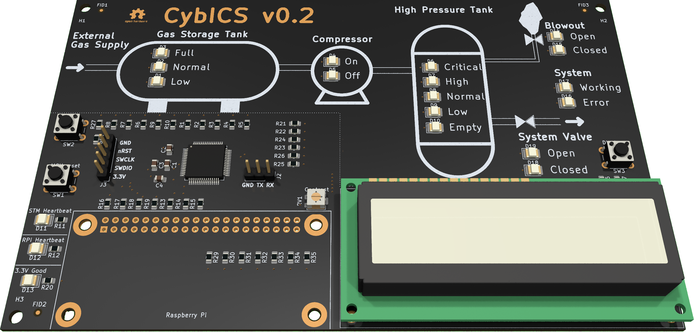

---

  

---

## Physical Process
For educational purpose, a very simple process has been chosen.
The process represents a control loop, where the system needs a specific gas pressure.
This pressure is achieved by a compressor from a gas storage tank (GST) compressing the gas in the high pressure tank (HPT) buffer.
The gas is toxic and flammable.
It will be released and burned via a mechanical blow-out valve, if there is a critical overpressure in the HPT.

All pressure values are in bar above normal atmospheric pressure.

### High Pressure Tank
The high pressure tank is the tank that serves as a buffer for the system pressure.
The measurement unit of the sensor is in bar.

| Pressure    | Description | Range       |
| ----------- | ----------- | ----------- |
| <1          | Empty       | 0-0         |
| <50         | Low         | 1-49        |
| <100        | Normal      | 50-99       |
| <150        | High        | 100-149     |
| 150+        | Critical    | 150-255     |

### System
The system can be operated in the normal pressure range between 50 to 99 bar.

## Hardware

<table align="center"><tr><td align="center" width="9999">
</img>
</td></tr></table>

| Component        | Description                      |
| ---------------- | -------------------------------- |
| Base Board       | Simulating the physical process  |
| Raspberry Pi     | Controlling the physical process |
| Display          | HD44780 1602 LCD                 |

## Software

| Component        | Description                   | Running on   |
| ---------------- | ----------------------------- | ------------ |
| OpenPLC          | Programmable Logic Controller | Raspberry Pi |
| FUXA             | Historian and HMI             | Raspberry Pi |
| Physical Process |                               | STM32        |

## Abbreviations
| Abbreviation | Long                   | Description |
| ------------ | ---------------------- | ----------- |
| GST          | Gas Storage Tank       |             |
| HPT          | High Pressure Tank     |             |
