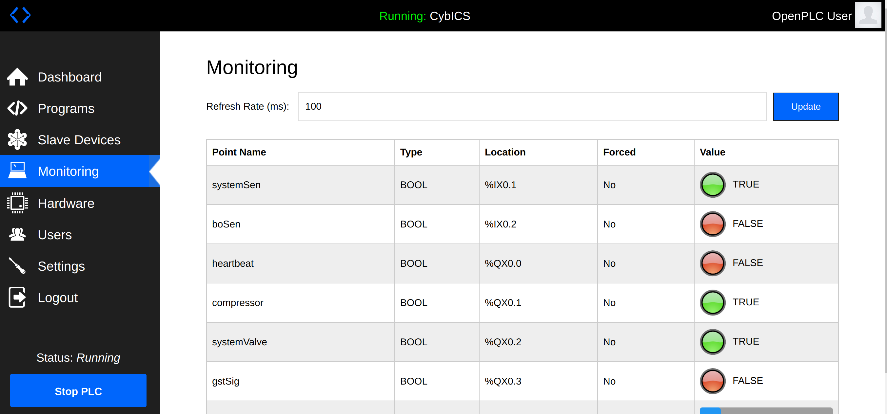

  
  
Understanding industrial Cybersecurity.

---

---

The CybICS project is interesting for anyone who wants to delve into the world of industrial cybersecurity or deepen their knowledge.

## Getting Started

First, read through this page to get a better understanding of the testbed setup.

 - [CybICS](#cybics)
 - [Physical Process](#physical)
 - [Hardware](#hardware)
 - [Software](#software)
 - [Getting Started](doc/README.md)
 - [Training](#training)
 - [Abbreviations](#abbreviations)

## CybICS  
Chose your side 🔵 🔴 

<table>
<tr>
<td width="50%" valign="top">

### 💻 Virtual
Docker-based deployment for easy setup

</td>
<td width="50%" valign="top">

### 🔧 Physical (Optional)
Hardware-based deployment with Raspberry Pi

</td>
</tr>
</table>

## Physical Process  
For educational purpose, a very simple process has been chosen.
The process represents a control loop, where the system needs a specific gas pressure.
This pressure is achieved by a compressor from a gas storage tank (GST) compressing the gas in the high pressure tank (HPT) buffer.
The gas is toxic and flammable.
It will be released and burned via a mechanical blow-out valve, if there is a critical overpressure in the HPT.

All pressure values are in bar above normal atmospheric pressure.

### Gas Storage Tank (GST)
The gas storage is used to buffer gas from the external gas supply.
The pressure from the external gas supply can not be regulated.
Only the fill level of the GST will be controlled by the PLC.

| Pressure    | Description | Range       |
| ----------- | ----------- | ----------- |
| <50         | Low         | 0-49        | 
| <150        | Normal      | 50-99       |
| 150+        | Full        | 150-255     |

**Controll Loop:**
The GST is kept between 60 and 240 with a simple control (Filling GST to GST < 240 when GST < 60).
The compressor to fill up the HPT can only run if the GST is at least filled up to a normal filling level.

### High Pressure Tank (HPT)
The high pressure tank is the tank that serves as a buffer for the system pressure.
The measurement unit of the sensor is in bar.

| Pressure    | Description | Range       |
| ----------- | ----------- | ----------- |
| <1          | Empty       | 0-0         |
| <50         | Low         | 1-49        |
| <100        | Normal      | 50-99       |
| <150        | High        | 100-149     |
| 150+        | Critical    | 150-255     |

**Controll Loop:**
The HPT is kept between 60 and 90 with a simple control.
(Running compressor when HPT < 60 up to HPT < 90)

### System
The system can be operated in the normal pressure range between 50 to 100 bar (HPT > 50 & HPT < 100).
If the pressure is too low, the system can not operate.
If the pressure if too high, the system can be damaged.

### Blowout (BO)
The blowout valve is a mechanical valve.
This is not operated by the PLC.
It will open and release toxic gas if the HPT pressure is above 220 bar to prevent bursting of the HPT.
The blowout will release the toxic gas, until it is again in a range below 200 bar (BO open when HPT > 220 until HPT > 200).

## Hardware  
The hardware is kept minimal and ready to order.
([link](hardware/README.md))

## Software  
The software contains all necessary elements to setup the CybICS testbed.
For development two VSCode devcontainers are available.
One for the STM32 controller, which is simulating the physical process and another for all the software running on the Raspberry Pi.
([link](software/README.md))

| Component        | Description                   | Running on   |
| ---------------- | ----------------------------- | ------------ |
| OpenPLC          | Programmable Logic Controller | Raspberry Pi |
| FUXA             | Historian and HMI             | Raspberry Pi |
| Physical Process |                               | STM32        |

### Fuxa and OpenPLC
For controlling the physical process, OpenPLC is used.
This is an open source PLC, with an web interfce for programming and configuration.
FUXA is used as an HMI and historian, with an web interface for the operator.

<table align="center"><tr><td align="center" width="9999">
</img>
</img>
</td></tr></table>

## Training  
This part of the repository offers an insight into possible learning and training units.
On the one hand, these include basic knowledge about PLCs and physical processes, as well as cyber attacks [link](training/README.md).

## Abbreviations  
| Abbreviation | Long                            | Description |
| ------------ | ------------------------------- | ----------- |
| GST          | Gas Storage Tank                |             |
| HPT          | High Pressure Tank              |             |
| LED          | Light-emitting Diode            |             |
| PCB          | Printed Circuit Board           |             |
| PLC          | Programmable Logic Controller   |             |
