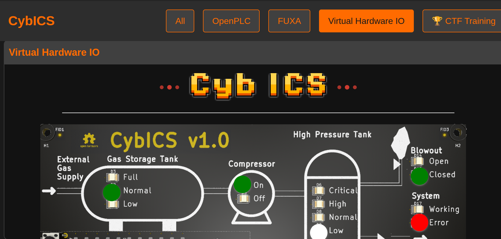
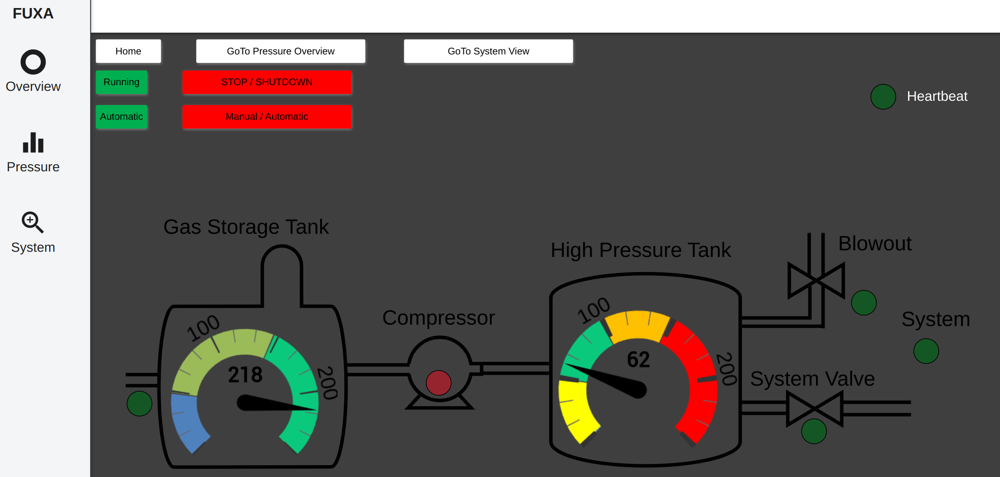

# CybICS Getting Started Guide

There are two ways to interact with the CybICS learning platform. The first and preferred method is through the physical hardware. Alternatively, you can run the platform in a virtual environment using Docker Compose.

## Virtual Environment

The virtual environment provides a complete cybersecurity testbed for Industrial Control Systems running entirely in Docker containers.

### Prerequisites

- Docker (version 20.10 or later)
- Docker Compose (version 2.0 or later)
- At least 4GB of available RAM
- At least 10GB of free disk space

### Quick Start with cybics.sh

The easiest way to run CybICS is using the `cybics.sh` management script located in the repository root.

#### Starting CybICS

```bash
./cybics.sh start
```

This will start all CybICS services in full mode by default.

#### Startup Modes

CybICS supports three different startup modes to match your needs:

1. **Full Mode** (default) - All services including AI Agent, Engineering Workstation, and Attack Machine:
   ```bash
   ./cybics.sh start --mode full
   # or simply
   ./cybics.sh start
   ```

2. **Minimal Mode** - Core services only (OpenPLC, FUXA, HWIO, OPC UA, S7, Landing):
   ```bash
   ./cybics.sh start --mode minimal
   ```

3. **Without AI Mode** - All services except the AI Agent:
   ```bash
   ./cybics.sh start --mode withoutai
   ```

#### Other Commands

```bash
./cybics.sh stop              # Stop all services
./cybics.sh restart           # Restart all services
./cybics.sh status            # Show status of all services
./cybics.sh logs              # Show logs from all services
./cybics.sh update            # Pull latest Docker images
./cybics.sh clean             # Remove all containers, images, and volumes
./cybics.sh compose ps        # Direct docker compose commands
```

#### Updating CybICS

To pull the latest Docker images for all services:

```bash
./cybics.sh update
```

After updating, restart the environment to apply changes:

```bash
./cybics.sh restart
```

#### Specifying Version

You can specify a specific Docker image version:

```bash
./cybics.sh start --version 1.0.0
./cybics.sh start --mode full --version latest
```

### Alternative: Manual Docker Compose

If you prefer to use Docker Compose directly:

1. Prepare the environment:
   ```bash
   .devcontainer/prepare-env.sh
   ```

2. Navigate to the virtual environment directory:
   ```bash
   cd .devcontainer/virtual
   ```

3. Start the containers:
   ```bash
   docker compose up -d
   ```

4. Stop the containers:
   ```bash
   docker compose down
   ```

### Accessing CybICS Services

Once started, the following services are available:

| Service | URL | Description |
|---------|-----|-------------|
| **Landing Page** | [http://localhost:80](http://localhost:80) | Main dashboard with access to all services |
| **HWIO (3D Visualization)** | [http://localhost:8090](http://localhost:8090) | 3D visualization of the physical process |
| **OpenPLC** | [http://localhost:8080](http://localhost:8080) | PLC programming and runtime environment |
| **FUXA HMI** | [http://localhost:1881](http://localhost:1881) | SCADA/HMI interface |
| **Engineering Workstation** | [http://localhost:6080/vnc.html](http://localhost:6080/vnc.html) | VNC desktop environment (full/withoutai modes) |
| **Attack Machine** | [http://localhost:6081/vnc.html](http://localhost:6081/vnc.html) | Kali-based attack environment (full/withoutai modes) |
| **OPC UA Server** | opc.tcp://localhost:4840 | OPC UA protocol endpoint |
| **S7 Communication** | localhost:102 | Siemens S7 protocol endpoint |

**Note:** Engineering Workstation and Attack Machine are only available in `full` and `withoutai` modes.

### Landing Page

The landing page serves as the central hub for accessing all CybICS services. It features:

- **Interactive Service Cards**: Quick access to all running services
- **Detach Mode**: Open services in separate windows for multi-monitor setups
- **System Statistics**: Real-time monitoring of container status
- **AI Agent** (full mode only): Interactive AI assistant for CybICS questions
- **Theme Support**: Light and dark mode

<table align="center"><tr><td align="center" width="9999">
</img>
</td></tr></table>

### HWIO - 3D Physical Process Visualization

HWIO provides a 3D visualization of the physical process, simulating the same behavior as the physical PCB hardware.

<table align="center"><tr><td align="center" width="9999">
</img>
</td></tr></table>

### OpenPLC Runtime

OpenPLC is an open-source PLC that allows you to program industrial controllers using standard IEC 61131-3 languages.

<table align="center"><tr><td align="center" width="9999">
</img>
</td></tr></table>

**Default credentials:**
- Username: `openplc`
- Password: `openplc`

### FUXA SCADA/HMI

FUXA provides a web-based SCADA/HMI interface for monitoring and controlling the industrial process.

<table align="center"><tr><td align="center" width="9999">
</img>
</td></tr></table>

### Engineering Workstation

A full desktop environment with engineering tools pre-installed. Access via VNC through your web browser.

<table align="center"><tr><td align="center" width="9999">
</img>
</td></tr></table>

**Available in:** Full mode, Without AI mode

### Attack Machine

A Kali Linux-based environment with cybersecurity tools for penetration testing and security research.

<table align="center"><tr><td align="center" width="9999">
</img>
</td></tr></table>

**Available in:** Full mode, Without AI mode

### CybICS AI Agent

The AI Agent provides an interactive assistant that can answer questions about CybICS, ICS security, and help with training scenarios.

**Available in:** Full mode only

**Features:**
- Natural language question answering
- Knowledge base with 40+ training documents
- Context-aware responses about CybICS platform
- Resizable chat interface
- Session history preservation

## VS Code / Codium Devcontainer (Alternative)

VS Code or Codium is required for this method.

1. Open VS Code/Codium in the CybICS repository
2. When prompted, select "Reopen in Container"
3. Choose "CybICS-virtual" from the devcontainer options

<table align="center"><tr><td align="center" width="9999">
</img>
</td></tr></table>

## Using the Physical Hardware

For this setup, the hardware must be fully configured and operational.
See [Hardware](../hardware/README.md) and [Software](../software/README.md).

### The PCB

The PCB (Printed Circuit Board) for the CybICS platform serves as the essential backbone, orchestrating the integration of all components necessary for the platform's operation.
More than just a hardware foundation, the PCB acts as a dynamic interface that mimics the behavior of physical processes, while also simulating both sensors and actuators.

The hardware is powered through a USB-C connector, ensuring efficient and reliable power delivery.
A dedicated reset button allows for easy resetting of the physical process (microcontroller).
Connectivity to the testbed is established via Wi-Fi, with a button that toggles between station and access point (AP) mode.
Additionally, a separate button enables switching between different display modes.

<table align="center"><tr><td align="center" width="9999">
</img>
</td></tr></table>

### Connecting to the Testbed

To connect to the testbed, use the built-in Wi-Fi functionality.
After powering on, the device takes approximately one minute to boot and initialize the process.

In AP mode, the CybICS platform creates a network named "cybics-XXXXXX," secured with the password `1234567890`.
Alternatively, in station mode, the device attempts to join an existing network named "cybics" using the same password.

### Access the Hardware Testbed

First **connect in AP mode** to access the different applications running on the system.

The same web interfaces are available as in the virtual environment, but accessed through the device's IP address instead of localhost.

## Troubleshooting

### Services Not Starting

If services fail to start, check:

1. Docker is running: `docker info`
2. No port conflicts: `sudo netstat -tulpn | grep -E ':(80|8080|8090|1881|6080|6081)'`
3. Sufficient system resources: `docker stats`
4. Docker logs: `./cybics.sh logs`

### Network Conflicts

If you encounter network overlap errors:

```bash
./cybics.sh stop
docker network prune
./cybics.sh start
```

The script will automatically detect and help resolve network conflicts.

### AI Agent Not Responding

If the AI Agent shows as unavailable:

1. Check the agent container is running: `docker ps | grep cybicsagent`
2. Check agent logs: `docker logs virtual-cybicsagent-1`
3. Restart in full mode: `./cybics.sh restart --mode full`

## Next Steps

- Explore the [Training Modules](../training/) for hands-on cybersecurity scenarios
- Review the [Software Documentation](../software/) for detailed component information
- Join our community and contribute on [GitHub](https://github.com/mniedermaier/CybICS)

## License

CybICS is open-source software licensed under the MIT License.
