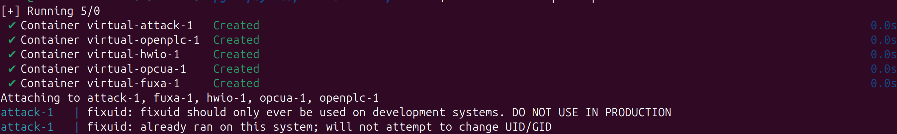
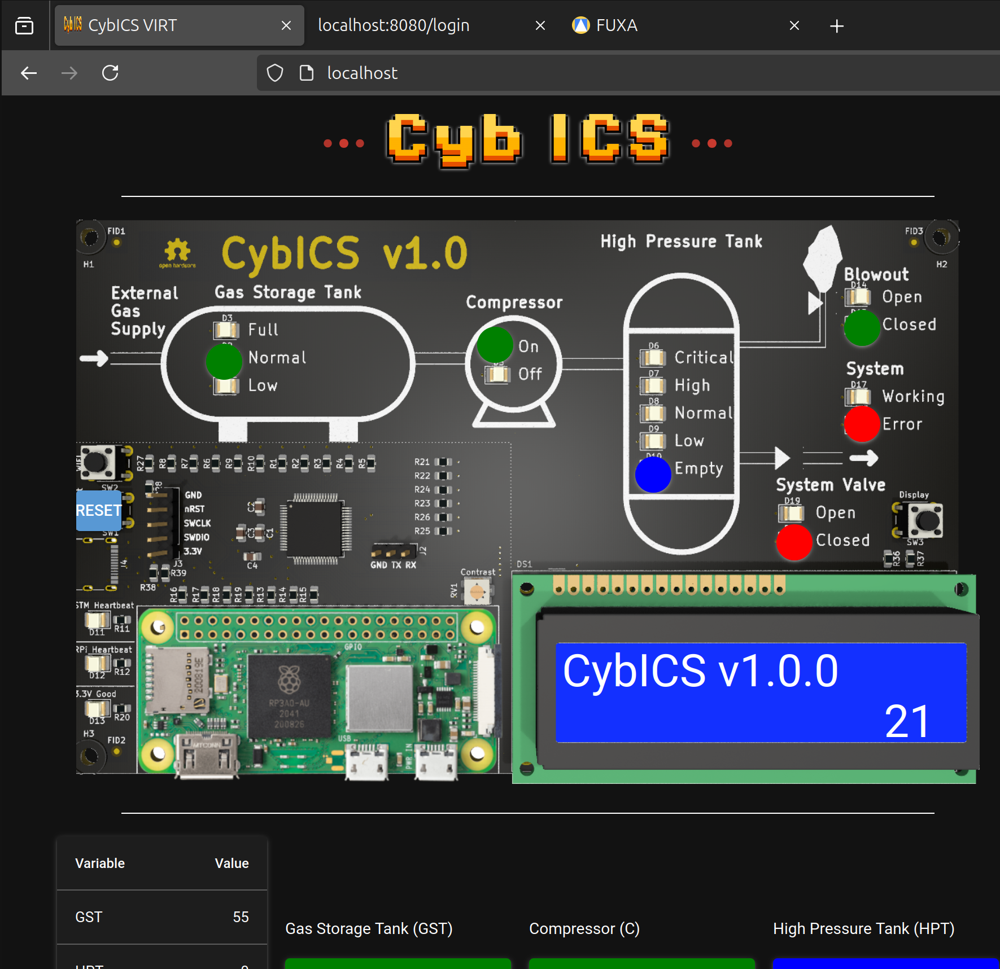

# Getting Started
There are two ways to interact with the CybICS learning platform. The first and preferred method is through the physical hardware.
Alternatively, you can run the platform in a virtual environment using Docker Compose.

## Using the Hardware (preferred method)
For this setup, the hardware must be fully configured and operational.
See [Hardware](../hardware/README.md) and [Software](../software/README.md).

### The PCB
The PCB (Printed Circuit Board) for the CybICS platform serves as the essential backbone, orchestrating the integration of all components necessary for the platform’s operation.
More than just a hardware foundation, the PCB acts as a dynamic interface that mimics the behavior of physical processes, while also simulating both sensors and actuators. 

The hardware is powered through a USB-C connector, ensuring efficient and reliable power delivery.
A dedicated reset button allows for easy resetting of the physical process (microcontroller).
Connectivity to the testbed is established via Wi-Fi, with a button that toggles between station and access point (AP) mode.
Additionally, a separate button enables switching between different display modes.

<table align="center"><tr><td align="center" width="9999">
</img>
</td></tr></table>

### Connecting to the Testbed
To connect to the testbed, use the built-in Wi-Fi functionality.
After powering on, the device takes approximately one minute to boot and initialize the process.

In AP mode, the CybICS platform creates a network named "cybics-XXXXXX," secured with the password 1234567890. 
Alternatively, in station mode, the device attempts to join an existing network named "cybics" using the same password.

### Access the Testbed
First **connect in AP mode** to access the different applications running on the system.

## Virtual Environment
As a requriement docker and docker compose needs to be setup on the system.

### Option 1: Run within VS Code / Codium Devcontainer
VS Code oder Codium is required for this method.
After starting VS Code / Codium, you are asked to open the git project in a container.
By selecting CybICS-Virtual, the virtual CybICS is started.

<table align="center"><tr><td align="center" width="9999">
</img>
</td></tr></table>

### Option 2: Run within Terminal
Prepare the environment with:
```sh
.devcontainer/prepare-env.sh
```

Switch to the location of the docker compose file.
```sh
cd CybICS/.devcontainer/virtual
```

Start the containers.
```sh
sudo docker compose up
```

The output should look like the following:
<table align="center"><tr><td align="center" width="9999">
</img>
</td></tr></table>

With CTRL+C, the containers can be stopped again.


### Access to the Virtual CybICS
The applications provide a webinterface for monitoring and configuration.

| What              | link/url                                         |
|-------------------|--------------------------------------------------|
| Physical process  | [http://localhost/](http://localhost/)           |
| OpenPLC           | [http://localhost:8080/](http://localhost:8080/) |
| FUXA HMI          | [http://localhost:1881/](http://localhost:1881/) |


Example of the virtual physical process (same represenation as the PCB).
<table align="center"><tr><td align="center" width="9999">
</img>
</td></tr></table>

