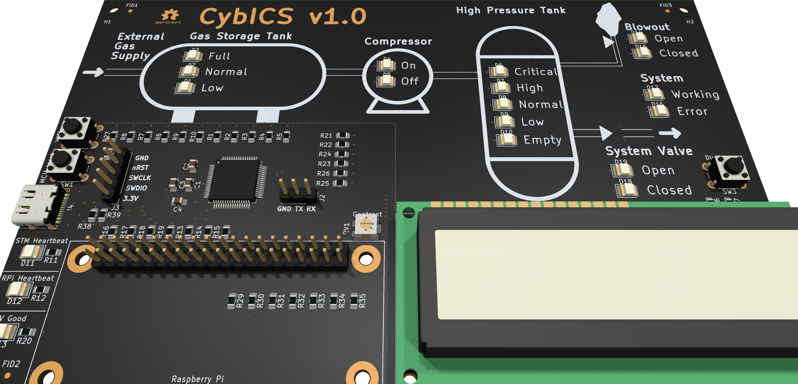

## Hardware  
The hardware was kept simple and cost-efficient.
All you need is the CybICS baseboard, a Raspberry Pi Zero 2 W and a 1602 display.
For the physical process visualization on the PCB a few LEDs are used.

<table align="center"><tr><td align="center" width="9999">
</img>
</td></tr></table>

The PCB can be ordered completly assembled at [JLCPCB](https://jlcpcb.com/).
The total cost for a testbed is around 50 euros.
However, the minimum purchase of PCBs is 5 pieces when ordered from [JLCPCB](https://jlcpcb.com/).

### Components
The hardware consists of three core components.
Additionally, there is a 3D printable case,
which makes desk usage easier ([link](case/README.md)).

| Component        | Description                             |
| ---------------- | --------------------------------------- |
| Base Board       | Simulating the physical process         |
| Raspberry Pi     | Controlling the physical process        |
| Display          | HD44780 1602 LCD showing physical state |

## Bill of Materials (BOM)

### Required Components

| Item | Quantity | Description | Approx. Cost (EUR) | Notes |
|------|----------|-------------|-------------------|-------|
| **CybICS PCB** | 1 | Custom PCB with STM32G070RBT6 | ~40 | Min. order 5 pieces from JLCPCB |
| **Raspberry Pi Zero 2 W** | 1 | 1GHz quad-core ARM Cortex-A53 | ~15 | Includes WiFi and Bluetooth |
| **1602 LCD Display** | 1 | HD44780 compatible, I2C interface | ~3 | Blue or green backlight |
| **MicroSD Card** | 1 | 8GB or larger, Class 10 | ~5 | For Raspberry Pi OS |
| **USB-C Cable** | 1 | Power supply cable | ~3 | 5V/2A minimum |
| **Pin Headers** | 1 set | 2.54mm pitch headers for Raspberry Pi | ~2 | Usually included with RPi |

**Total Estimated Cost**: ~50-70 EUR per complete unit

### Optional Components

| Item | Quantity | Description | Approx. Cost (EUR) | Notes |
|------|----------|-------------|-------------------|-------|
| **3D Printed Case** | 1 | Protective enclosure | ~5 | Filament + printing time |
| **Stand/Base** | 1 | Simple display stand | ~2 | See standSimple/ directory |
| **USB Power Adapter** | 1 | 5V/2.5A wall adapter | ~5 | If not using PC USB |

### Where to Buy

#### PCB Manufacturing
- **JLCPCB**: https://jlcpcb.com/ (Recommended - full assembly available)
  - Upload Gerber files from `hardware/pcb/` directory
  - Select assembly service (PCBA)
  - Minimum order: 5 boards
  - Lead time: ~2 weeks

#### Raspberry Pi
- **Official Raspberry Pi Resellers**: https://www.raspberrypi.com/products/
- Local electronics distributors (varies by country)

#### LCD Display
- Common suppliers: AliExpress, Amazon, local electronics shops
- Search for: "1602 LCD I2C" or "1602A LCD module"

#### MicroSD Card
- Any reputable brand (SanDisk, Samsung, Kingston)
- Minimum 8GB, Class 10 or better recommended

## Upgrading and Modifications

### Using Different Raspberry Pi Models
The hardware is designed for Raspberry Pi Zero 2 W but can work with:
- **Raspberry Pi Zero W**: Lower performance but compatible
- **Raspberry Pi 3/4**: Will not perfectly fit

### Custom PCB Modifications
The KiCad project files in `hardware/pcb/` can be modified to:
- Add additional sensors or actuators
- Change LED colors or positions
- Modify STM32 pinout
- Add expansion connectors

## Safety Considerations

⚠️ **Important Safety Notes**:
- Use only 5V power supplies - higher voltages will damage components
- Do not connect/disconnect components while powered
- Ensure proper ESD (electrostatic discharge) precautions when handling PCB
- Keep away from water and conductive materials
- Do not modify PCB traces without proper knowledge

## Support and Resources

- **PCB Design Files**: See `hardware/pcb/` directory
- **3D Case Files**: See `hardware/case/` directory
- **Schematic PDF**: Available in `hardware/pcb/` directory
- **STM32 Firmware**: See `software/stm32/` directory
- **Assembly Guide**: This document

For technical support, please open an issue on the GitHub repository.

