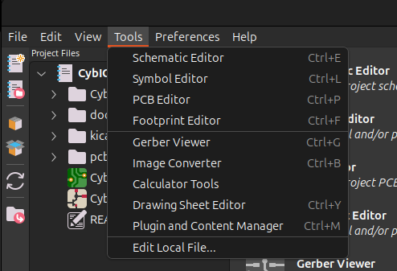
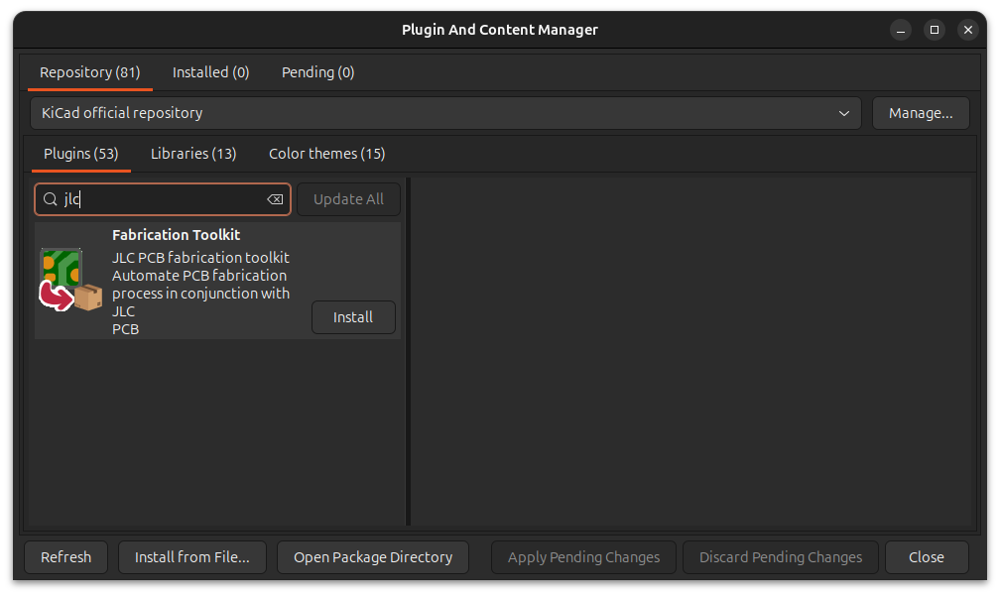
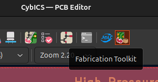
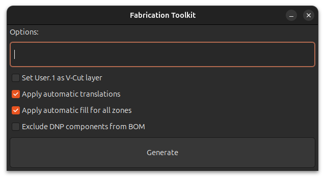

# CybICS PCB Ordering Guide

## Overview
This guide provides detailed instructions for ordering the CybICS PCB from JLCPCB with full assembly service. The PCB is designed to be manufactured and assembled by JLCPCB, eliminating the need for manual soldering.

## PCB Design Files
The PCB is designed using KiCad 8.x and all source files are available in this directory:
- **Schematic**: Shows the circuit design and connections
- **PCB Layout**: Physical board design with component placement
- **Gerber Files**: Manufacturing files for PCB fabrication
- **BOM (Bill of Materials)**: List of all components
- **CPL (Component Placement List)**: Positions for automated assembly

## Prerequisites

### Software Requirements
1. **KiCad** (version 8.0 or later)
   - Download from: https://www.kicad.org/download/
   - Used to view and modify PCB design files

2. **Fabrication Toolkit Plugin** (for KiCad)
   - Install via KiCad Plugin and Content Manager
   - Generates files compatible with JLCPCB

### JLCPCB Account
- Create a free account at: https://jlcpcb.com/
- No credit card required for registration

## Step-by-Step Ordering Process

### Step 1: Open the PCB in KiCad

1. Launch KiCad
2. Open the CybICS project file (`.kicad_pro`)
3. Open the PCB Editor
4. Review the design to ensure it's correct

### Step 2: Install Fabrication Toolkit

1. In KiCad, go to **Tools** → **Plugin and Content Manager**
2. Search for "Fabrication Toolkit"
3. Click "Install" and wait for installation to complete
4. Restart KiCad if prompted

<table align="center"><tr><td align="center" width="9999">
</img>
</td></tr></table>

<table align="center"><tr><td align="center" width="9999">
</img>
</td></tr></table>

### Step 3: Generate Fabrication Files

1. Open the PCB Editor in KiCad
2. Click on the **Fabrication Toolkit** icon in the toolbar
3. Configure the export settings:
   - **Manufacturer**: Select "JLCPCB"
   - **Include assembly**: Check this option
   - **Output directory**: Leave as default ("production")
4. Click **Generate** to create all necessary files

<table align="center"><tr><td align="center" width="9999">
</img>
</td></tr></table>

<table align="center"><tr><td align="center" width="9999">
</img>
</td></tr></table>

The toolkit will generate:
- `gerber.zip` - PCB manufacturing files
- `bom.csv` - Bill of materials for component ordering
- `positions.csv` - Component placement file for assembly

### Step 4: Upload to JLCPCB

1. Go to https://jlcpcb.com/
2. Click **Quote Now** or **Instant Quote**
3. Click **Add Gerber File** and upload `gerber.zip`
4. Wait for the system to process the file (~30 seconds)

### Step 5: Configure PCB Options

After upload, configure the following options:

### Step 6: Enable PCB Assembly

1. Scroll down and toggle **PCB Assembly** to ON

### Step 7: Upload BOM and CPL Files

1. Click **Confirm** on the assembly section
2. Upload the BOM file:
   - Click **Add BOM File**
   - Select `bom.csv` from the production folder
3. Upload the CPL file:
   - Click **Add CPL File**
   - Select `positions.csv` from the production folder
4. Click **Process BOM & CPL**

### Step 8: Component Matching

After processing, JLCPCB will display component matching:

1. **Review matched components**:
   - Green checkmark: Component found in JLCPCB inventory
   - Yellow warning: Alternative suggested
   - Red X: Component not available

2. **For unavailable components**:
   - Click on the component row
   - Search for alternatives in JLCPCB library

3. **Verify component orientation**:
   - Check the preview image
   - Ensure components are rotated correctly
   - Adjust rotation angle if needed (+90°, -90°, 180°)

### Step 9: Review and Confirm

1. Click **Next** after component matching
2. Review the component placement preview:
   - Verify all components are in correct positions
   - Check orientation of polarized components (ICs, LEDs, capacitors)
   - Ensure no components are missing
3. If everything looks correct, click **Save to Cart**

### Step 10: Checkout and Payment

## Verification Before Ordering

### Pre-Order Checklist
- [ ] Gerber files generated successfully
- [ ] BOM includes all components
- [ ] CPL file has correct positions
- [ ] All components available in JLCPCB inventory
- [ ] Schematic reviewed for errors
- [ ] PCB layout passes DRC
- [ ] Board dimensions correct
- [ ] Test points accessible
- [ ] Programming header included
- [ ] Power supply specifications verified

### Design Verification
Use KiCad's 3D viewer to visualize the assembled board:
1. **View** → **3D Viewer**
2. Check component placement
3. Verify connector orientations
4. Ensure no mechanical conflicts

## Alternative Manufacturers

While this guide focuses on JLCPCB, the PCB can also be ordered from:

- **PCBWay**: https://www.pcbway.com/
- **ALLPCB**: https://www.allpcb.com/
- **Elecrow**: https://www.elecrow.com/

Each manufacturer has slightly different processes and pricing. Export files may need adjustment for other manufacturers.

## Related Documentation
- [Hardware Overview](../README.md)
- [STM32 Firmware Flashing](../../software/stm32/README.md)
- [Assembly Instructions](../README.md#assembly-instructions)
- [KiCad Documentation](https://docs.kicad.org/)

## Version History

Check the git history for PCB revisions:
```bash
git log --oneline -- hardware/pcb/
```

Each revision may have different components or layout. Ensure you're using the latest stable version.
