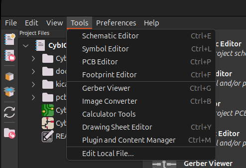
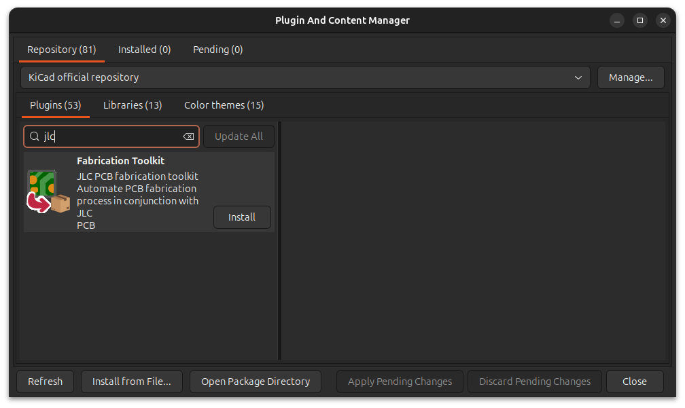
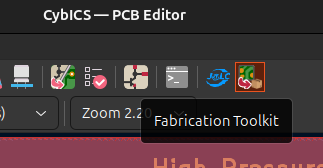
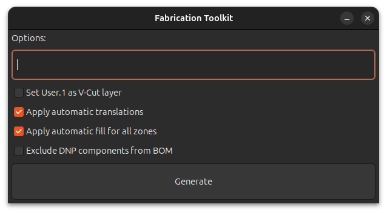

# CybICS PCB Ordering Guide

## Overview
This guide provides detailed instructions for ordering the CybICS PCB from JLCPCB with full assembly service. The PCB is designed to be manufactured and assembled by JLCPCB, eliminating the need for manual soldering.

## PCB Design Files
The PCB is designed using KiCad 10.x and all source files are available in this
directory. The sources are stored in the KiCad 10 file format, so KiCad 8 and 9
cannot open them -- install KiCad 10 or later before doing anything below:
- **Schematic**: Shows the circuit design and connections
- **PCB Layout**: Physical board design with component placement
- **Gerber Files**: Manufacturing files for PCB fabrication
- **BOM (Bill of Materials)**: List of all components
- **CPL (Component Placement List)**: Positions for automated assembly

### Project 3D models

`cybics.3dshapes/` holds the models KiCad does not ship. Each one that was
generated rather than downloaded keeps its build script next to it, so it can
be regenerated instead of being an unmaintainable binary:

| Model | Source | Notes |
|-------|--------|-------|
| `Raspberry_Pi_Zero.step` | `Raspberry_Pi_Zero.build.py` (CadQuery) | J1's second model, so the Pi appears plugged onto the board |
| `SW-SMD_8P-...step/.wrl` | vendor download (LCSC C2858287) | navigation switch SW3 |

The Pi Zero model sits 11.0 mm above the board: 2.5 mm for the male header body
on the carrier plus 8.5 mm for the socket on the Pi's underside, which is the
standard Pi HAT spacing. The Pi is mounted **component side up** -- despite
"FaceDown" in the footprint name -- so the model puts every part on the top
face. Check `doc/pics/cybics.png` if in doubt; that photograph is what the
model was built against.

Outline, mounting holes and the three edge-connector centres come from the
official mechanical drawing; component positions are measured off that
photograph and agree with the drawing's connector centres to about 0.4 mm,
which is what fixes the scale. The parts are simplified shapes rather than
vendor geometry, but carry the detail that makes a render readable:
silkscreen frame and lettering, plated rings around the mounting holes,
the raspberry on the SiP, a stamped microSD lid, recessed connector
mouths, gold test pads, and passives split into black chip resistors and
pale MLCCs the way the photograph shows them. Two caveats: the PCB thickness of 1.4 mm is an assumption, as
the drawing does not state one, and the microSD card protrudes 2.1 mm past the
board edge, which is outside J1's `F.Fab` envelope -- that is real, and worth
knowing when designing an enclosure. The 2x20 socket on the Pi's underside is
deliberately not modelled, because the carrier's own header model already fills
that volume.

Regenerate with:

```bash
cd hardware/pcb/cybics.3dshapes
python3 -m venv .venv && .venv/bin/pip install cadquery
.venv/bin/python Raspberry_Pi_Zero.build.py
```

Note that `J4`'s USB-C model is missing from the Ubuntu `kicad-packages3d`
package, so that connector is absent from local 3D renders. The path in the
board matches what the KiCad 10 library footprint itself declares, so it
resolves on a complete installation.

## Prerequisites

### Software Requirements
1. **KiCad** (version 10.0 or later)
   - Download from: https://www.kicad.org/download/
   - Used to view and modify PCB design files
   - On Ubuntu, the KiCad project's PPA carries current releases:
     `sudo add-apt-repository ppa:kicad/kicad-10.0-releases && sudo apt install kicad`

2. **Fabrication Toolkit Plugin** (for KiCad)
   - Install via KiCad Plugin and Content Manager
   - Generates files compatible with JLCPCB

### JLCPCB Account
- Create a free account at: https://jlcpcb.com/
- No credit card required for registration

## Step-by-Step Ordering Process

### Step 1: Open the PCB in KiCad

1. Launch KiCad
2. Open the CybICS project file (`.kicad_pro`)
3. Open the PCB Editor
4. Review the design to ensure it's correct

### Step 2: Install Fabrication Toolkit

1. In KiCad, go to **Tools** → **Plugin and Content Manager**
2. Search for "Fabrication Toolkit"
3. Click "Install" and wait for installation to complete
4. Restart KiCad if prompted

<table align="center"><tr><td align="center" width="9999">
</img>
</td></tr></table>

<table align="center"><tr><td align="center" width="9999">
</img>
</td></tr></table>

### Step 3: Generate Fabrication Files

1. Open the PCB Editor in KiCad
2. Click on the **Fabrication Toolkit** icon in the toolbar
3. Leave the export options at their defaults. The plugin targets JLCPCB
   already, so there is no manufacturer to choose -- earlier revisions of this
   guide described a **Manufacturer** dropdown that the plugin does not have.
   In particular leave **Plot all active layers** switched off: this is a
   two-layer board, and enabling it only adds the fabrication and courtyard
   layers to the archive, which JLCPCB does not need.
4. Click **Generate** to create all necessary files

<table align="center"><tr><td align="center" width="9999">
</img>
</td></tr></table>

<table align="center"><tr><td align="center" width="9999">
</img>
</td></tr></table>

The toolkit will generate:
- `gerber.zip` - PCB manufacturing files
- `bom.csv` - Bill of materials for component ordering
- `positions.csv` - Component placement file for assembly

### Step 4: Upload to JLCPCB

1. Go to https://jlcpcb.com/
2. Click **Quote Now** or **Instant Quote**
3. Click **Add Gerber File** and upload `gerber.zip`
4. Wait for the system to process the file (~30 seconds)

### Step 5: Configure PCB Options

After upload, configure the following options:

### Step 6: Enable PCB Assembly

1. Scroll down and toggle **PCB Assembly** to ON

### Step 7: Upload BOM and CPL Files

1. Click **Confirm** on the assembly section
2. Upload the BOM file:
   - Click **Add BOM File**
   - Select `bom.csv` from the production folder
3. Upload the CPL file:
   - Click **Add CPL File**
   - Select `positions.csv` from the production folder
4. Click **Process BOM & CPL**

### Step 7b: Check the version straps are not placed

`R40` and `R46` are marked **DNP** -- they encode the hardware revision by
being absent (see [Hardware Version Coding](../README.md#version-coding)).
Confirm they are missing from the uploaded BOM and CPL. The Fabrication
Toolkit skips DNP parts, but verify it rather than assume: if JLCPCB places
them, the board reports the wrong revision.

Every other `R41`-`R44` and `R47`-`R50` must be placed.

### Step 8: Component Matching

After processing, JLCPCB will display component matching:

1. **Review matched components**:
   - Green checkmark: Component found in JLCPCB inventory
   - Yellow warning: Alternative suggested
   - Red X: Component not available

2. **For unavailable components**:
   - Click on the component row
   - Search for alternatives in JLCPCB library

3. **Verify component orientation**:
   - Check the preview image
   - Ensure components are rotated correctly
   - Adjust rotation angle if needed (+90°, -90°, 180°)

### Step 9: Review and Confirm

1. Click **Next** after component matching
2. Review the component placement preview:
   - Verify all components are in correct positions
   - Check orientation of polarized components (ICs, LEDs, capacitors)
   - Ensure no components are missing
3. If everything looks correct, click **Save to Cart**

### Step 10: Checkout and Payment

## Verification Before Ordering

### Pre-Order Checklist
- [ ] Gerber files generated successfully
- [ ] BOM includes all components
- [ ] CPL file has correct positions
- [ ] All components available in JLCPCB inventory
- [ ] Schematic reviewed for errors
- [ ] PCB layout passes DRC
- [ ] Board dimensions correct
- [ ] Test points accessible
- [ ] Programming header included
- [ ] Power supply specifications verified

### Design Verification
Use KiCad's 3D viewer to visualize the assembled board:
1. **View** → **3D Viewer**
2. Check component placement
3. Verify connector orientations
4. Ensure no mechanical conflicts

## Alternative Manufacturers

While this guide focuses on JLCPCB, the PCB can also be ordered from:

- **PCBWay**: https://www.pcbway.com/
- **ALLPCB**: https://www.allpcb.com/
- **Elecrow**: https://www.elecrow.com/

Each manufacturer has slightly different processes and pricing. Export files may need adjustment for other manufacturers.

## Related Documentation
- [Hardware Overview](../README.md)
- [STM32 Firmware Flashing](../../software/stm32/README.md)
- [Assembly Instructions](../README.md#assembly-instructions)
- [KiCad Documentation](https://docs.kicad.org/)

## Version History

Check the git history for PCB revisions:
```bash
git log --oneline -- hardware/pcb/
```

Each revision may have different components or layout. Ensure you're using the latest stable version.
