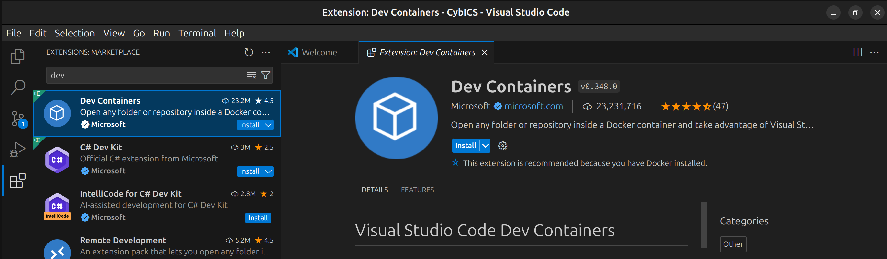
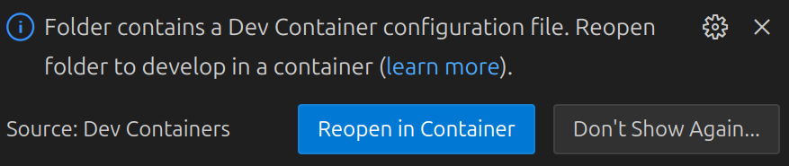

# Install the Development Environment

## Install docker
Follow the installation guide for docker:
(https://docs.docker.com/engine/install/ubuntu/#install-using-the-repository)

Add the current user to the docker group:
```sh
sudo usermod -aG docker $USER
```

## Install VS Code
Follow the installation guide for VS Code:
(https://code.visualstudio.com/docs/setup/linux)

## Clone the repository
As this repository uses git submodules, use the following to clone it.
```sh
git clone https://github.com/mniedermaier/CybICS.git --recursive
```

If you have already cloned it without the `--recursive` flag, you can do this to also get the submodules afterwards:
```sh
git submodule update --init --recursive
```

## Open CybICS Repository in VS Code
Change to the git root folder:
```sh
cd CybICS
```

Run VS Code in the root of the repository:
```sh
code .
```

Install the dev container plugin:
<table align="center"><tr><td align="center" width="9999">
</img>
</td></tr></table>

Reopen the repository in dev container (be sure you have added the current user to the docker group):
<table align="center"><tr><td align="center" width="9999">
</img>
</td></tr></table>

If an error occurred on the initial setup, try to reload.
The initial build of the dev container will take several minutes depending on your Internet connection and compute performance.

# Setting-up the Raspberry Pi Zero
## Install Raspberry Pi OS using Raspberry Pi Imager
With the help of the Raspberry Pi Imager, the basic linux installation on the SD card can be done.
The software can b e download for Windows, macOS, and Linux from the Raspberry Pi homepage (https://www.raspberrypi.com/software/).
After installation start the rpi-imager software.

<table align="center"><tr><td align="center" width="9999">
</img>
</td></tr></table>

Click on "CHOOSE DEVICE" and select "No filtering".

<table align="center"><tr><td align="center" width="9999">
</img>
</td></tr></table>

Click on "CHOOSE OS" &rarr; "Raspberry Pi OS (other)" and select "Raspberry Pi OS Lite (64-bit)".

<table align="center"><tr><td align="center" width="9999">
</img>
</td></tr></table>

Click on "CHOOSE STORAGE" and select the SD card, where the image should be installed.

<table align="center"><tr><td align="center" width="9999">
</img>
</td></tr></table>

Click NEXT and select "EDIT SETTINGS":
<table align="center"><tr><td align="center" width="9999">
</img>
</td></tr></table>

Edit the options for image customization:
- Set hostname to "CybICS".
- Set username and password
  - Username: pi
  - Password: raspberry
- Configure wireless LAN
  - SSID: "your SSID"
  - Password: "your password"
- Configure local settings

<table align="center"><tr><td align="center" width="9999">
</img>
</img>
</td></tr></table>


Write the changes to the SD card.

# Installation of the CybICS Software
The .dev.env in the root folder of the repository needs to be configured properly with the IP and user name of the Raspberry Pi.

## Option 1: Execute the Installation Script inside VS Code
The dev container needs to be "software".
To switch dev conainters press "Ctrl+Shift+P" and select "Dev Conainters: Switch Container".
Open a new terminal in VS Code with "Ctrl+Shift+`"


Change to the software folder
```sh
cd software/
```

Execute the installation script:
```sh
./installRPI.sh
```

The initial build of all containers takes up to one hour.
During the installation, it is necessary to type in the password of the Raspberry Pi.


## Option 2: Execute Installation Script without VS Code

Start the container and execute the installation script.
```sh
cd CybICS
docker compose -f .devcontainer/software/docker-compose.yml up -d --build
docker compose -f .devcontainer/software/docker-compose.yml exec dev /CybICS/software/installRPI.sh
```

Optional: Remove the installation container.
```sh
docker compose -f .devcontainer/software/docker-compose.yml down
```

## Useful docker commands

<details>
  <summary>Unfold</summary>
  
  List container:
  ```sh
  sudo docker ps
  ```

  Start terminal within container:
  ```sh
  sudo docker exec -it <mycontainer_name> bash
  ```

  Copy file from docker container:
  ```sh
  sudo docker cp <container_name>:<path_to_copy> <output_dir>
  ```
</details>