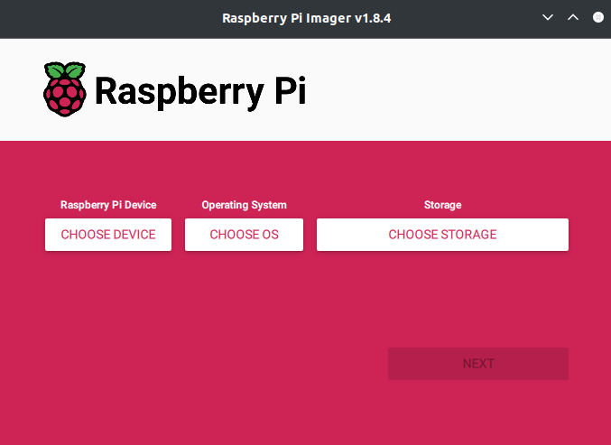
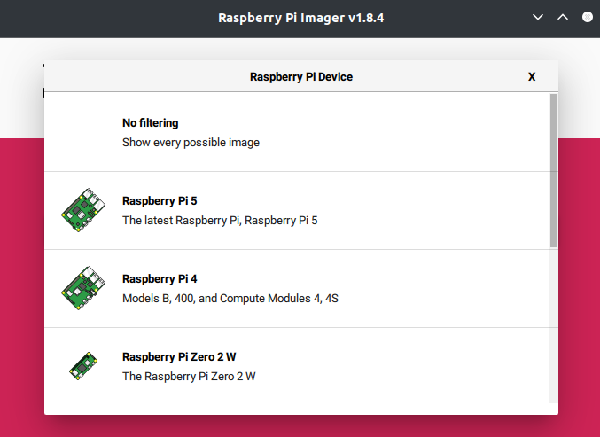
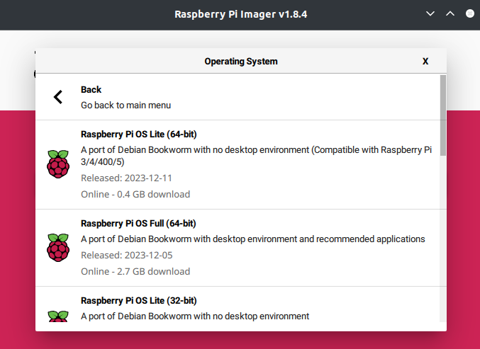
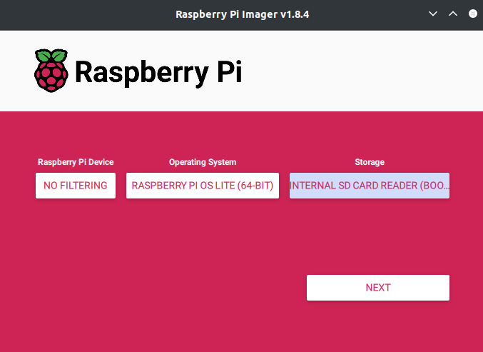
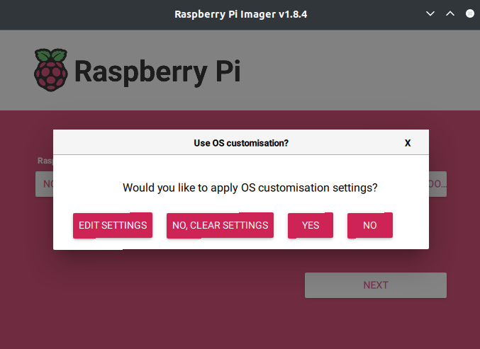
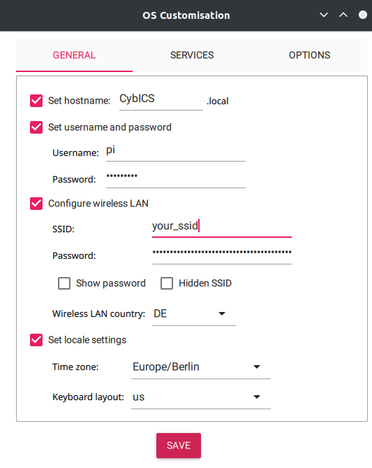
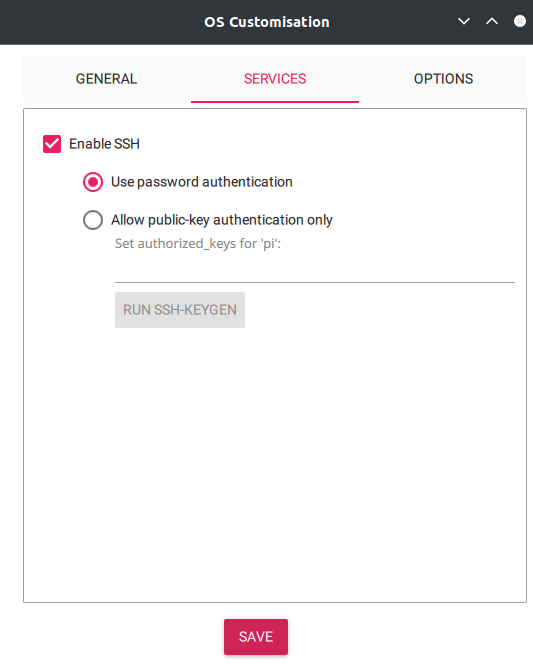

# Setting-up the Raspberry Pi Zero
## Install Raspberry Pi OS using Raspberry Pi Imager
With the help of the Raspberry Pi Imager, the basic linux installation on the SD card can be done.
The software can b e download for Windows, macOS, and Linux from the Raspberry Pi homepage (https://www.raspberrypi.com/software/).
After installation start the rpi-imager software.

<table align="center"><tr><td align="center" width="9999">
</img>
</td></tr></table>

Click on "CHOOSE DEVICE" and select "No filtering".

<table align="center"><tr><td align="center" width="9999">
</img>
</td></tr></table>

Click on "CHOOSE OS" &rarr; "Raspberry Pi OS (other)" and select "Raspberry Pi OS Lite (64-bit)".

<table align="center"><tr><td align="center" width="9999">
</img>
</td></tr></table>

Click on "CHOOSE STORAGE" and select the SD card, where the image should be installed.

<table align="center"><tr><td align="center" width="9999">
</img>
</td></tr></table>

Click NEXT and select "EDIT SETTINGS":
<table align="center"><tr><td align="center" width="9999">
</img>
</td></tr></table>

Edit the options for image customization:
- Set hostname to "CybICS".
- Set username and password
  - Username: pi
  - Password: raspberry
- Configure wireless LAN
  - SSID: "your SSID"
  - Password: "your password"
- Configure local settings

<table align="center"><tr><td align="center" width="9999">
</img>
</img>
</td></tr></table>


Write the changes to the SD card.

## Clone the repository
As this repository uses git submodules, use the following to clone it.
```bash
git clone https://github.com/mniedermaier/CybICS.git --recursive
```

If you have already cloned it without the `--recursive` flag, you can do this to also get the submodules afterwards:
```
git submodule update --init --recursive
```

## Execute installation script
Install docker compose.
```sh
sudo apt install docker-compose
```

Start the container and execute the installation script.
```sh
cd CybICS
docker compose -f .devcontainer/software/docker-compose.yml up -d --build
docker compose -f .devcontainer/software/docker-compose.yml exec dev /CybICS/software/installRPI.sh
```

Optional: Remove the installation container.
```sh
docker compose -f .devcontainer/software/docker-compose.yml down
```
