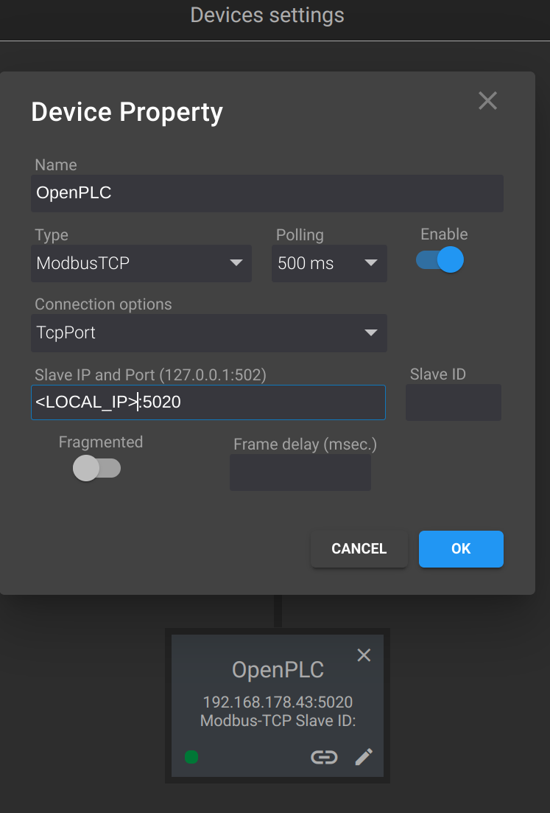

# 🕵️‍♂️ Man-in-the-Middle (MitM) Attack Guide

> **MITRE ATT&CK for ICS:** `Collection` `Evasion` | [T0830 - Adversary-in-the-Middle](https://attack.mitre.org/techniques/T0830/) | [T0856 - Spoof Reporting Message](https://attack.mitre.org/techniques/T0856/)

## 📋 Overview
This guide explains how to create a Modbus TCP proxy in Python that listens on all network interfaces (`0.0.0.0`).
The proxy intercepts Modbus traffic between a Modbus client and a Modbus server, allowing you to manipulate the traffic (requests and responses) like a "man-in-the-middle" attack.

## 🧑‍💻 What is a Man-in-the-Middle Attack?
A Man-in-the-Middle (MITM) attack is a type of cyberattack where a malicious actor secretly intercepts and possibly alters the communication between two parties, without either party realizing it. In the context of Modbus TCP, a widely used protocol in industrial control systems (ICS) for communication between controllers (like PLCs) and devices (like sensors or actuators), a MITM attack can be particularly dangerous.

### 🔄 Modbus TCP MITM Flow
Modbus TCP works over a TCP/IP network and follows a client-server model, where:
- **Client** (usually the Human-Machine Interface (HMI) or SCADA system) sends Modbus requests (like read/write commands) to control devices.
- **Server** (typically a Programmable Logic Controller (PLC) or other field devices) responds to these commands.

In a MITM attack on Modbus TCP, an attacker positions themselves between the client and the server to intercept and manipulate Modbus requests and responses.

```
Client     🕵️‍♂️ Attacker (Proxy)  Server
   |            |              |
   |----->      |              |
   |            |----->        |
   |            |<-----        |
   |<-----      |              |
```

This shows the basic flow:
- Client sends a request (----->) to the Attacker (posing as the server).
- Attacker forwards the request to the Server.
- Server responds (<-----) to the Attacker.
- Attacker potentially modifies and sends the response back to the Client.

## 🛠️ Prerequisite: Admin Access on FUXA HMI
Before setting up the Python proxy for intercepting Modbus traffic, you need administrator access on the FUXA HMI. This is necessary to modify the IP settings of the connected PLC, directing its communication through the Python proxy.

With admin access, you'll be able to change the PLC's configuration to use the proxy's IP address and port, ensuring all traffic is routed through the proxy for monitoring and manipulation.



## 🚀 Example: Running the Proxy
An example of this proxy can be found in the `mitm.py` file. 
By default, it does not modify or manipulate any values, allowing the proxy to only focus on significant traffic changes. You can easily extend it to customize the manipulations as needed for your specific use case.
For this, a good understanding of Modbus/TCP is required.

```sh
python3 mitm.py
```

## 🎯 Find the Flag
The flag has the format `CybICS(flag)`.

## 🛡️ Security Framework References

<details>
  <summary>Click to expand</summary>

### MITRE ATT&CK for ICS

| Tactic | Technique | ID | Description |
|--------|-----------|-----|-------------|
| Collection | Adversary-in-the-Middle | [T0830](https://attack.mitre.org/techniques/T0830/) | Adversaries may position themselves between endpoints to intercept and manipulate communications |
| Evasion | Spoof Reporting Message | [T0856](https://attack.mitre.org/techniques/T0856/) | Adversaries may spoof messages to hide malicious activity from operators |

**Why this matters:** Man-in-the-Middle attacks allow adversaries to intercept, monitor, and modify communications between HMI/SCADA systems and PLCs. Since Modbus lacks authentication, an attacker can inject commands, modify responses, or hide attacks from operators. This was demonstrated in the Industroyer/CrashOverride malware, which used similar techniques to control power grid equipment while hiding its actions from operators.

### MITRE D3FEND - Defensive Countermeasures

| Technique | ID | Description |
|-----------|-----|-------------|
| Encrypted Tunnels | [D3-ET](https://d3fend.mitre.org/technique/d3f:EncryptedTunnels/) | Encrypting communications to prevent interception |
| Network Traffic Analysis | [D3-NTA](https://d3fend.mitre.org/technique/d3f:NetworkTrafficAnalysis/) | Detecting anomalous traffic patterns indicating MitM |
| Message Authentication | [D3-MAN](https://d3fend.mitre.org/technique/d3f:MessageAuthentication/) | Authenticating messages to detect tampering |
| Network Segmentation | [D3-NI](https://d3fend.mitre.org/technique/d3f:NetworkIsolation/) | Limiting attacker positioning opportunities |

### NIST SP 800-82r3 Reference

| Control Family | Controls | Relevance |
|----------------|----------|-----------|
| **System and Communications Protection (SC)** | SC-7, SC-8, SC-23 | Boundary protection, transmission confidentiality, and session authenticity |
| **System and Information Integrity (SI)** | SI-4, SI-7 | System monitoring and data integrity verification |
| **Access Control (AC)** | AC-4 | Information flow enforcement |

**Why NIST 800-82r3 matters here:** NIST 800-82r3 Section 6.2.10 identifies the lack of authentication in legacy protocols as a critical vulnerability. SC-8 (Transmission Confidentiality) and SC-23 (Session Authenticity) recommend cryptographic protections where feasible. When protocol encryption isn't possible, SC-7 (Boundary Protection) and AC-4 (Information Flow Enforcement) become critical—limiting which systems can communicate with which devices reduces MitM opportunities. SI-4 (System Monitoring) helps detect the traffic anomalies that MitM attacks create.

</details>

## 🔍 Solution

<details>
  <summary><span style="color:orange;font-weight: 900">Click to expand</span></summary>

  After completion, use the following flag:
  <div style="color:orange;font-weight: 900">
    🚩 Flag: CybICS(mitm_attack_successful)
  </div>

</details>
