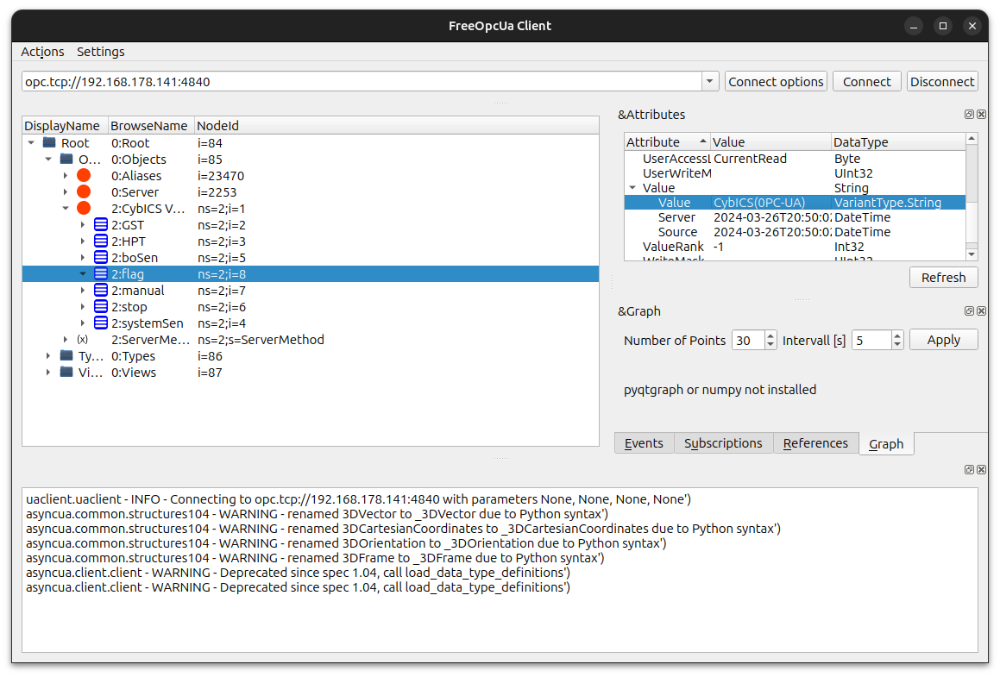

# OPC UA

In this example we try to attack OPA UA.
For this install opcua-client.

```sh
pip3 install opcua-client
```


## Find the flag
The flag has the format "CybICS(flag)".

**Hint**: The flag is written to a OPC UA variable
<details>
  <summary>Solution</summary>
  
  ##
  
  
</details>