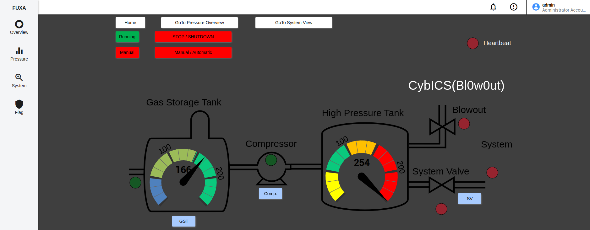

# 🏭 Understanding the Physical Process

> **MITRE ATT&CK for ICS:** `Impair Process Control` | [T0831 - Manipulation of Control](https://attack.mitre.org/techniques/T0831/)

## 📋 Overview
In an industrial environment, the physical process refers to the actual operations and mechanisms involved in manufacturing, processing, or producing goods.
This includes activities such as the movement of raw materials through conveyor belts, the operation of machinery to shape or assemble components, and the monitoring of variables like temperature, pressure, and flow rates to ensure optimal performance.
These processes are often controlled and monitored by industrial control systems (ICS) and Supervisory Control and Data Acquisition (SCADA) systems, which provide real-time data and automation capabilities to enhance efficiency and safety.

The physical process is critical to the overall productivity and quality of an industrial operation.
Ensuring that all components work harmoniously and efficiently is essential to maintain high standards of output and to avoid downtime or accidents.
Regular maintenance, calibration, and monitoring of the equipment are necessary to keep the physical process running smoothly and to detect any potential issues before they escalate into major problems.

Read through the process description in the main [readme](../../README.md) and understand how the control loop works.

## 🎮 Manual Control Exercise
Try to control the process manually as an operator via the FUXA HMI.

### 📝 Steps
1. 🌐 Open a web browser and connect to the FUXA HMI `http://<IP>:1881`
2. 🔑 Login with the credentials `operator:operator`
3. 🔄 Switch to the system view
4. ⚡ Click the red button "Manual / Automatic"
5. 🎛️ Control the different valves and operate the system manually

## 🎯 Find the Flag
The flag has the format `CybICS(flag)`.
To get the flag, the blowout needs to be triggered.

**💡 Hint**: The flag appears on the FUXA HMI, when the blowout was triggered.

## 🛡️ Security Framework References

  
Click to expand

### MITRE ATT&CK for ICS

| Tactic | Technique | ID | Description |
|--------|-----------|-----|-------------|
| Impair Process Control | Manipulation of Control | [T0831](https://attack.mitre.org/techniques/T0831/) | Adversaries may manipulate physical process control within the industrial environment to cause a disruption |

**Why this matters:** This training demonstrates how an operator (or attacker with operator access) can manipulate process control parameters to cause unsafe conditions. In real-world attacks like Stuxnet or TRITON, adversaries manipulated control systems to cause physical damage or safety incidents. Understanding normal process operation is essential before learning to detect malicious manipulation.

### MITRE D3FEND - Defensive Countermeasures

| Technique | ID | Description |
|-----------|-----|-------------|
| Operational Process Monitoring | [D3-OPM](https://d3fend.mitre.org/technique/d3f:OperationalProcessMonitoring/) | Monitoring operational processes for anomalies that may indicate compromise |
| Physical Environment Monitoring | [D3-PEM](https://d3fend.mitre.org/technique/d3f:PhysicalEnvironmentMonitoring/) | Monitoring physical environment conditions to detect abnormal states |

### NIST SP 800-82r3 Reference

| Control Family | Controls | Relevance |
|----------------|----------|-----------|
| **Physical and Environmental Protection (PE)** | PE-3, PE-6 | Physical access control and monitoring of OT environments |
| **System and Information Integrity (SI)** | SI-4, SI-13 | System monitoring and predictive maintenance to detect unsafe process states |

**Why NIST 800-82r3 matters here:** Understanding the physical process is foundational to implementing effective security controls. NIST 800-82r3 Section 5 emphasizes that OT security must account for the unique characteristics of physical processes, including safety implications of process manipulation. This training helps you understand what "normal" looks like—essential for detecting anomalies later.

## 🔍 Solution

  
Click to expand

  After login on the FUXA dashboard switch to the "System" view.
  By closing the "System Valve" (SV) and enabling the Compressor (C),
  the pressure is rising.
  After a certain time, the pressure in the High Pressure Tank (HPT)
  gets a critical level and the Blowout (BO) will be opened.

  

    🚩 Flag: CybICS(Bl0w0ut)
  

  

