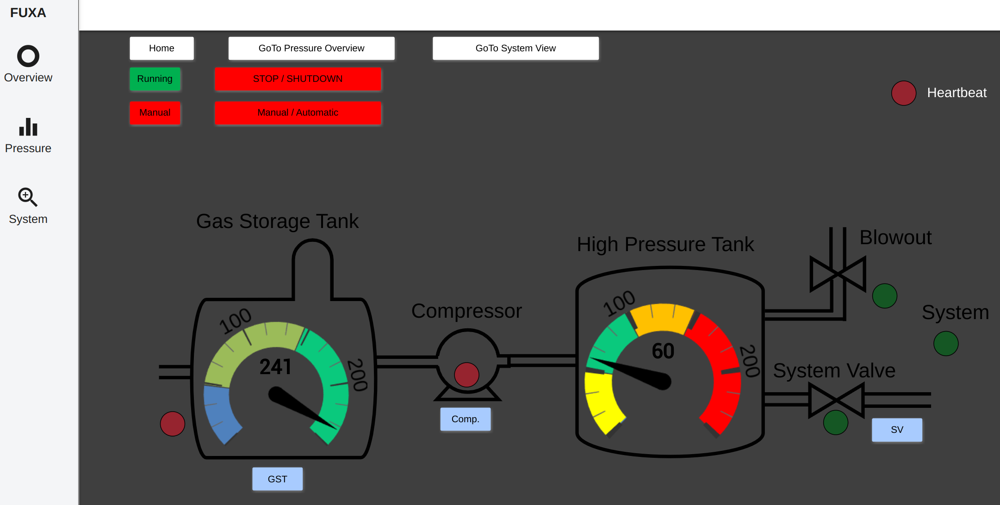

# Understanding the physical process
Read through the process description in the main [readme](../../README.md) and understand how the control loop works.

### Control the process manually
Try to control the process manually as an operator via the FUXA HMI.
1. Open a web browser and connect to the FUXA HMI http://<IP>:1881
1. Switch to the system view
1. click the red button "Manual / Automatic"
1. control the different valves and operate the system manually

