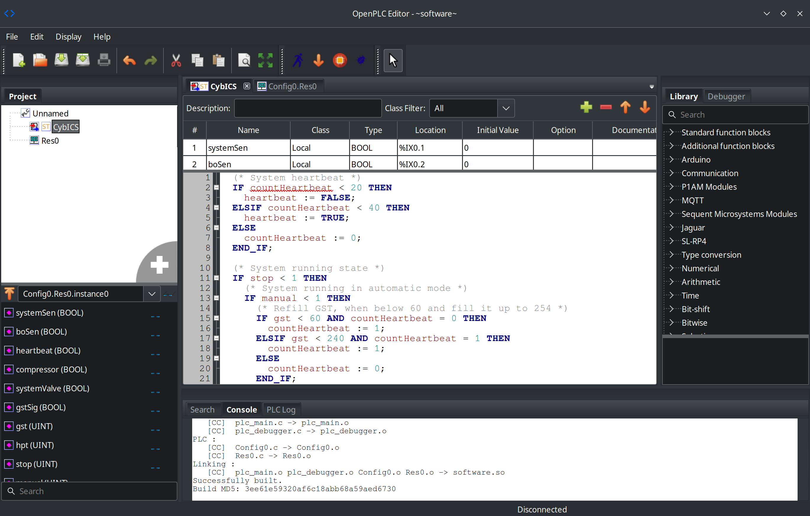

# 🏭 PLC Programming Guide

> **MITRE ATT&CK for ICS:** `Execution` `Persistence` | [T0889 - Modify Program](https://attack.mitre.org/techniques/T0889/) | [T0843 - Program Download](https://attack.mitre.org/techniques/T0843/)

## 📋 Overview
This module introduces the concept of programming the PLC in the CybICS testbed.

## 🛠️ OpenPLC Editor
OpenPLC Editor is a powerful, open-source tool designed for programming and configuring PLCs (Programmable Logic Controllers) using the IEC 61131-3 standard.
It provides a user-friendly interface for creating and managing control logic in various programming languages, such as Ladder Diagram (LD), Structured Text (ST), and Function Block Diagram (FBD).

With OpenPLC Editor, users can design and simulate control processes, making it easier to develop and test automation systems before deployment.
The editor supports real-time monitoring and debugging, allowing engineers to troubleshoot and refine their control logic efficiently.
Its compatibility with multiple PLC hardware platforms and its open-source nature make it a versatile and accessible option for both professionals and hobbyists in industrial automation.

## 🖥️ Using the Engineering Workstation (Virtual Environment Only)

**⚠️ Note: The Engineering Workstation is only available in the virtual environment, not on physical hardware.**

The easiest way to program the PLC is using the pre-configured Engineering Workstation Docker container. This provides a full desktop environment with OpenPLC Editor already installed and the CybICS project pre-loaded.

### 🔧 Setup Steps

1. Open your web browser and navigate to:
   ```
   http://localhost:6080/vnc.html
   ```

2. Click "Connect" (password: `cybics`)

3. Double-click the "OpenPLC Editor" icon on the desktop

4. The CybICS Beremiz project is available on the desktop at `/root/Desktop/CybICS/`

### 💻 Using the Editor

1. In the Engineering Workstation desktop, double-click "OpenPLC Editor"
2. Go to **File → Open Project**
3. Navigate to `/root/Desktop/CybICS/`
4. Select the folder and open `beremiz.xml`
5. The project contains the main PLC program named "CybICS"
6. Start making changes to the program

## 📥 Alternative: Local Installation

If you prefer to install OpenPLC Editor on your local machine instead of using the Engineering Workstation:

### 🔧 Setup Steps
1. Clone the repository of the OpenPLC editor:
   ```sh
   git clone https://github.com/thiagoralves/OpenPLC_Editor
   ```

2. Change into the folder of the OpenPLC editor:
   ```sh
   cd OpenPLC_Editor/
   ```

3. Start the installation script:
   ```sh
   ./install.sh
   ```

4. To start the OpenPLC editor:
   ```sh
   ./openplc_editor.sh
   ```

### 💻 Using the Editor (Local Installation)
1. Open OpenPLC Editor
2. Go to **File → Open Project**
3. Navigate to `training/plc_programming/software/`
4. Select the folder and open `beremiz.xml`
5. Start making changes to the program

## 🔄 Program Overview
The CybICS program manages the operation of an industrial system by controlling components like a compressor, system valve, and various signals based on input conditions and internal states.
It includes logic for automatic mode operation, with specific rules for refilling a tank, controlling a compressor, and adjusting outputs.
The program also manages a heartbeat signal and handles system stop conditions by deactivating components.
The countHeartbeat variable is used for timing purposes, and the program is configured to run periodically in the PLC environment.



## ⬆️ Uploading the Program
Upload the program to the OpenPLC via the web interface on port 8080.
Do not forget to delete the previous CybICS ST code.


## 🛡️ Security Framework References

<details>
  <summary>Click to expand</summary>

### MITRE ATT&CK for ICS

| Tactic | Technique | ID | Description |
|--------|-----------|-----|-------------|
| Execution | Modify Program | [T0889](https://attack.mitre.org/techniques/T0889/) | Adversaries may modify or add programs on controllers to affect how they interact with physical processes |
| Persistence | Program Download | [T0843](https://attack.mitre.org/techniques/T0843/) | Adversaries may download programs to controllers to establish persistence or modify process behavior |

**Why this matters:** PLC program modification is one of the most impactful attack vectors in ICS environments. Attacks like Stuxnet used modified PLC code to cause centrifuge damage while hiding the manipulation from operators. Understanding legitimate PLC programming helps you recognize unauthorized changes and implement proper change management controls.

### MITRE D3FEND - Defensive Countermeasures

| Technique | ID | Description |
|-----------|-----|-------------|
| Firmware Verification | [D3-FV](https://d3fend.mitre.org/technique/d3f:FirmwareVerification/) | Verifying firmware integrity to detect unauthorized modifications |
| File Hash Checking | [D3-FHC](https://d3fend.mitre.org/technique/d3f:FileHashChecking/) | Comparing file hashes to detect unauthorized program changes |
| Operational Logic Validation | [D3-OLV](https://d3fend.mitre.org/technique/d3f:OperationalLogicValidation/) | Validating that operational logic matches expected behavior |

### NIST SP 800-82r3 Reference

| Control Family | Controls | Relevance |
|----------------|----------|-----------|
| **Configuration Management (CM)** | CM-3, CM-5, CM-6 | Configuration change control, access restrictions, and baseline configurations |
| **System and Information Integrity (SI)** | SI-7 | Software, firmware, and information integrity verification |
| **Audit and Accountability (AU)** | AU-2, AU-12 | Logging of configuration changes and program modifications |

**Why NIST 800-82r3 matters here:** NIST 800-82r3 Section 6.2.5 specifically addresses the need for strict configuration management in OT environments. PLC programs are critical assets that directly control physical processes—unauthorized modifications can cause safety incidents, production disruptions, or equipment damage. This training builds the foundation for implementing CM-3 (Configuration Change Control) effectively.

</details>

## 🔍 Solution

<details>
  <summary><span style="color:orange;font-weight: 900">Click to expand</span></summary>

  After completion, use the following flag:
  <div style="color:orange;font-weight: 900">
    🚩 Flag: CybICS(ladder_logic_modified)
  </div>

</details>

