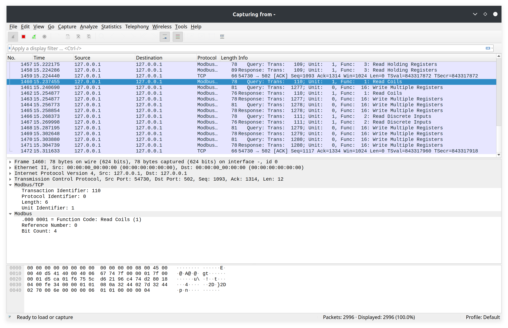
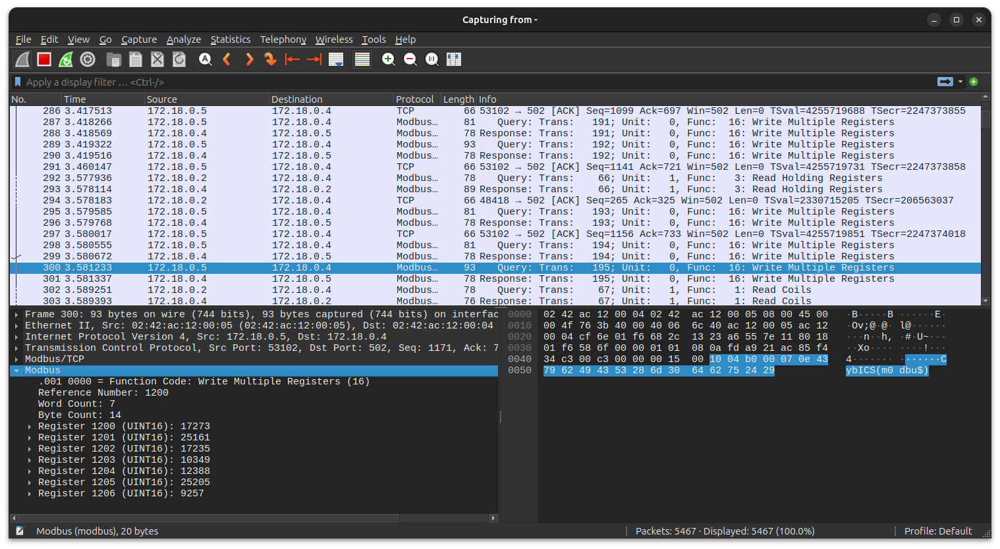

# Getting network traffic
In the context of industrial security, network traffic analysis is crucial for safeguarding industrial control systems (ICS) and Supervisory Control and Data Acquisition (SCADA) networks.
By monitoring and analyzing network traffic, security professionals can detect anomalies and unauthorized access attempts that may indicate a potential cyber attack or system breach.
This proactive approach helps in identifying unusual patterns or communication behaviors that could signify malicious activities, such as attempts to compromise critical infrastructure or disrupt operational processes.

Network traffic analysis in industrial environments also aids in ensuring compliance with security policies and regulatory requirements by providing visibility into data flows and system interactions.
It enables the identification of vulnerabilities within the network, such as outdated protocols or unprotected communication channels, and supports the implementation of effective security measures.
By leveraging advanced traffic analysis techniques, organizations can enhance their ability to detect and respond to threats, optimize network performance, and protect the integrity and availability of their industrial operations.

## Installation of Wireshark
Wireshark is a widely-used network protocol analyzer that provides detailed insights into network traffic by capturing and examining data packets.
It allows users to monitor, analyze, and troubleshoot network communications in real-time, making it an invaluable tool for network administrators, security professionals, and developers.
With its extensive protocol support and powerful filtering capabilities, Wireshark can dissect complex network protocols and identify issues such as performance bottlenecks, security vulnerabilities, and misconfigurations.

The user-friendly graphical interface of Wireshark enables users to visualize packet flows, inspect payloads, and follow network conversations with ease.
Additionally, it supports a wide range of export options for further analysis and reporting.
By leveraging Wireshark, organizations can enhance their network security posture, optimize performance, and ensure reliable and efficient network operations.


Install wireshark
```sh
sudo apt install wireshark
```

Ensure that the ssh key is deployed on the Raspberry Pi.
```sh
ssh-copy-id -i <path to id file> pi@$DEVICE_IP
```

## Wireshark Network capture
Start remote capture.
```sh
ssh pi@$DEVICE_IP -p 22 sudo tcpdump -U -s0 'not port 22' -i br-cybics -w - | sudo wireshark -k -i -
```

Here’s a breakdown of each component of the command:

* ssh pi@$DEVICE_IP -p 22:
  * This initiates an SSH (Secure Shell) connection to a remote device with the IP address specified by $DEVICE_IP. The pi is the username used to log in, and -p 22 specifies that SSH should use port 22, which is the default port for SSH.
* sudo tcpdump -U -s0 'not port 22' -i br-cybics -w -:
  * sudo: Executes tcpdump with superuser privileges, necessary for capturing network packets.
  * tcpdump: A command-line network packet analyzer that captures and displays network traffic.
  * -U: Writes the packets to the output in real-time, without buffering, which is useful for streaming data.
  * -s0: Sets the snapshot length to 0, which means tcpdump will capture the full packet size.
  * 'not port 22': Filters out traffic on port 22, which is used by SSH. This is to avoid capturing the SSH traffic that is being used to execute the command itself.
  * -i br-cybics: Specifies the network interface to capture traffic from. In this case, br-cybics is the network bridge or interface name.
  * -w -: Writes the captured packets to standard output (stdout), which is then piped to another command.
* | sudo wireshark -k -i -:
  * |: A pipe symbol that directs the output from the tcpdump command into the wireshark command.
  * sudo: Runs wireshark with superuser privileges, which may be required for network capturing.
  * wireshark: A graphical network protocol analyzer used to inspect and analyze network traffic.
  * -k: Tells wireshark to start capturing immediately and show the live capture window.
  * -i -: Specifies that wireshark should read from standard input (stdin), which is where tcpdump is writing the captured packets.

## Modbus/TCP

Modbus TCP is a communication protocol used for transmitting data over TCP/IP networks, specifically designed for industrial automation systems. It extends the Modbus protocol, which was originally developed for serial communication, to work over Ethernet. Here’s an explanation of its structure:

1. Protocol Structure
* Modbus Application Protocol (AP) Layer: This is the layer where the Modbus protocol operates. It defines the rules for data communication, including how requests and responses are formatted.

* Modbus TCP Frame Structure: The Modbus TCP frame includes several key components:

  * Header: The Modbus TCP header is composed of:
    * Transaction Identifier (2 bytes): This is a unique identifier for the request/response pair. It helps in matching requests with responses.
    * Protocol Identifier (2 bytes): Always set to 0x0000 for Modbus TCP, indicating that the protocol is Modbus.
    * Length Field (2 bytes): Specifies the length of the remaining bytes in the message, including the Modbus Application Protocol (AP) data.
    * Unit Identifier (1 byte): Identifies the specific device on the Modbus network, often used for addressing devices in Modbus gateways or multiplexers.
  * Modbus Application Protocol Data Unit (PDU): This part of the frame contains:
    * Function Code (1 byte): Specifies the type of action requested or performed (e.g., read, write, diagnostic).
    *  Data (variable length): Contains the actual data to be read or written, or includes other details related to the function code. The data structure varies depending on the function code.
2. Communication Process
  * Request: A Modbus TCP client sends a request to a Modbus TCP server (or slave). The request includes the Modbus TCP header followed by the PDU. The request specifies the function to be performed and any required data or parameters.

  * Response: The Modbus TCP server processes the request and sends a response back to the client. The response includes the Modbus TCP header and the PDU. The PDU in the response contains the results of the request or an error message if something went wrong.

3. Function Codes
* Modbus TCP uses function codes to define the operations that can be performed. These codes include:
  * Read Coils (Function Code 01): Read the status of discrete outputs.
  * Read Discrete Inputs (Function Code 02): Read the status of discrete inputs.
  * Read Holding Registers (Function Code 03): Read the contents of analog output registers.
  * Read Input Registers (Function Code 04): Read the contents of analog input registers.
  * Write Single Coil (Function Code 05): Write a single value to a discrete output.
  * Write Single Register (Function Code 06): Write a single value to an analog output register.
  * Write Multiple Coils (Function Code 15): Write values to multiple discrete outputs.
  * Write Multiple Registers (Function Code 16): Write values to multiple analog output registers.
4. Error Handling
* Exception Responses: If the Modbus TCP server encounters an error while processing a request, it sends an exception response. The exception response includes the function code of the original request and an exception code indicating the type of error encountered.

Summary
Modbus TCP combines the simplicity and robustness of the Modbus protocol with the flexibility and speed of TCP/IP networking. Its frame structure includes a header for managing communication and a PDU for specifying the action to be performed, allowing for effective data exchange in industrial automation systems. Understanding this structure helps in troubleshooting communication issues and developing applications that leverage Modbus TCP for device management and data acquisition.



## Find the flag
The flag has the format "CybICS(flag)".

**Hint**: The flag is written to registers over modbus.
<details>
  <summary>Solution</summary>
  
  ##
  :anger: Flag: CybICS(m0dbu$) 
  
</details>