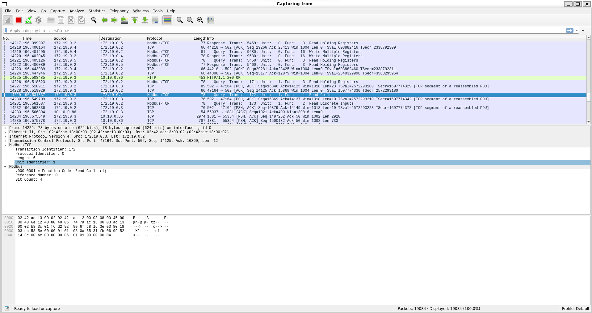

# 📡 Network Traffic Analysis Guide

> **MITRE ATT&CK for ICS:** `Collection` | [T0842 - Network Sniffing](https://attack.mitre.org/techniques/T0842/)

## 📋 Overview
In the context of industrial security, network traffic analysis is crucial for safeguarding industrial control systems (ICS) and Supervisory Control and Data Acquisition (SCADA) networks.
By monitoring and analyzing network traffic, security professionals can detect anomalies and unauthorized access attempts that may indicate a potential cyber attack or system breach.
This proactive approach helps in identifying unusual patterns or communication behaviors that could signify malicious activities, such as attempts to compromise critical infrastructure or disrupt operational processes.

Network traffic analysis in industrial environments also aids in ensuring compliance with security policies and regulatory requirements by providing visibility into data flows and system interactions.
It enables the identification of vulnerabilities within the network, such as outdated protocols or unprotected communication channels, and supports the implementation of effective security measures.
By leveraging advanced traffic analysis techniques, organizations can enhance their ability to detect and respond to threats, optimize network performance, and protect the integrity and availability of their industrial operations.

## 🛠️ Wireshark Installation
Wireshark is a widely-used network protocol analyzer that provides detailed insights into network traffic by capturing and examining data packets.
It allows users to monitor, analyze, and troubleshoot network communications in real-time, making it an invaluable tool for network administrators, security professionals, and developers.
With its extensive protocol support and powerful filtering capabilities, Wireshark can dissect complex network protocols and identify issues such as performance bottlenecks, security vulnerabilities, and misconfigurations.

The user-friendly graphical interface of Wireshark enables users to visualize packet flows, inspect payloads, and follow network conversations with ease.
Additionally, it supports a wide range of export options for further analysis and reporting.
By leveraging Wireshark, organizations can enhance their network security posture, optimize performance, and ensure reliable and efficient network operations.

### 🔧 Setup Steps
1. Install Wireshark:
   ```sh
   sudo apt install wireshark
   ```

2. Deploy SSH key to Raspberry Pi:
   ```sh
   ssh-copy-id -i <path to id file> pi@$DEVICE_IP
   ```

## 📊 Network Capture
Start remote capture with:
```sh
ssh pi@$DEVICE_IP -p 22 sudo tcpdump -U -s0 'not port 22' -i br-cybics -w - | sudo wireshark -k -i -
```

### 🔍 Command Breakdown
- **SSH Connection**:
  - `ssh pi@$DEVICE_IP -p 22`: Initiates SSH connection to remote device
  - Uses default port 22 for SSH communication

- **Tcpdump Options**:
  - `sudo`: Executes with superuser privileges
  - `-U`: Real-time packet writing without buffering
  - `-s0`: Captures full packet size
  - `'not port 22'`: Excludes SSH traffic
  - `-i br-cybics`: Specifies network interface
  - `-w -`: Writes to standard output

- **Wireshark Options**:
  - `-k`: Starts capture immediately
  - `-i -`: Reads from standard input

## 🔄 Modbus/TCP Protocol

### 📝 Protocol Structure
1. **Modbus Application Protocol (AP) Layer**
   - Defines data communication rules
   - Formats requests and responses

2. **Modbus TCP Frame Structure**
   - **Header Components**:
     - Transaction Identifier (2 bytes)
     - Protocol Identifier (2 bytes)
     - Length Field (2 bytes)
     - Unit Identifier (1 byte)
   - **Modbus PDU**:
     - Function Code (1 byte)
     - Data (variable length)

### 🔄 Communication Process
1. **Request**: Client sends request to server
2. **Response**: Server processes and responds

### 📋 Function Codes
- **01**: Read Coils
- **02**: Read Discrete Inputs
- **03**: Read Holding Registers
- **04**: Read Input Registers
- **05**: Write Single Coil
- **06**: Write Single Register
- **15**: Write Multiple Coils
- **16**: Write Multiple Registers

### ⚠️ Error Handling
- Exception responses for error conditions
- Includes original function code and error type



## 🎯 Find the Flag
The flag has the format `CybICS(flag)`.

**💡 Hint**: The flag is written to registers over modbus.

## 🛡️ Security Framework References

<details>
  <summary>Click to expand</summary>

### MITRE ATT&CK for ICS

| Tactic | Technique | ID | Description |
|--------|-----------|-----|-------------|
| Collection | Network Sniffing | [T0842](https://attack.mitre.org/techniques/T0842/) | Adversaries may sniff network traffic to capture information about the ICS environment |

**Why this matters:** Industrial protocols like Modbus TCP transmit data in plaintext without authentication or encryption. An attacker with network access can passively capture all process data, operator commands, and system configurations. This training demonstrates why network visibility cuts both ways—defenders need traffic analysis capabilities, but so do attackers.

### MITRE D3FEND - Defensive Countermeasures

| Technique | ID | Description |
|-----------|-----|-------------|
| Network Traffic Analysis | [D3-NTA](https://d3fend.mitre.org/technique/d3f:NetworkTrafficAnalysis/) | Using the same techniques defensively to detect anomalies |
| Encrypted Tunnels | [D3-ET](https://d3fend.mitre.org/technique/d3f:EncryptedTunnels/) | Encrypting industrial protocol traffic to prevent sniffing |
| Network Segmentation | [D3-NI](https://d3fend.mitre.org/technique/d3f:NetworkIsolation/) | Isolating OT networks to limit sniffing opportunities |

### NIST SP 800-82r3 Reference

| Control Family | Controls | Relevance |
|----------------|----------|-----------|
| **System and Communications Protection (SC)** | SC-8, SC-13 | Transmission confidentiality and cryptographic protection |
| **Audit and Accountability (AU)** | AU-3, AU-6 | Audit record content and review for network anomalies |
| **System and Information Integrity (SI)** | SI-4 | System monitoring including network traffic analysis |

**Why NIST 800-82r3 matters here:** NIST 800-82r3 Section 6.2.10 explicitly addresses the lack of security in legacy industrial protocols. SC-8 (Transmission Confidentiality) recommends using encrypted tunnels or protocol wrappers where possible. When encryption isn't feasible, SI-4 (System Monitoring) becomes even more critical—you should be capturing and analyzing the same traffic that attackers would target, looking for anomalies that indicate compromise.

</details>

## 🔍 Solution

<details>
  <summary><span style="color:orange;font-weight: 900">Click to expand</span></summary>

  <div style="color:orange;font-weight: 900">
    🚩 Flag: CybICS(m0dbu$)
  </div>

  
</details>